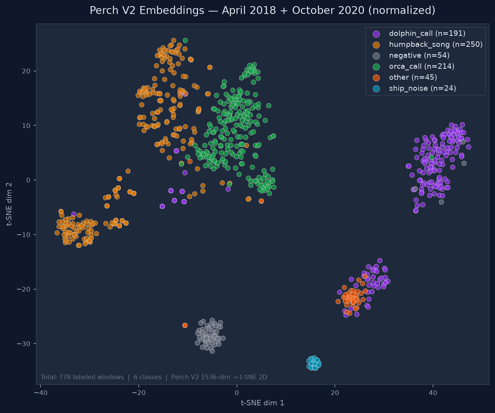
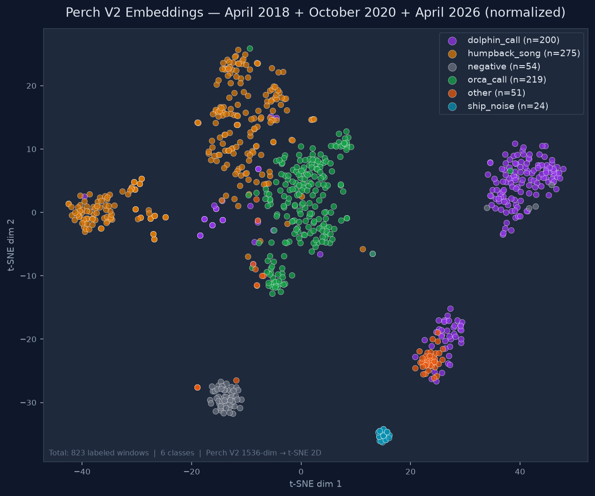
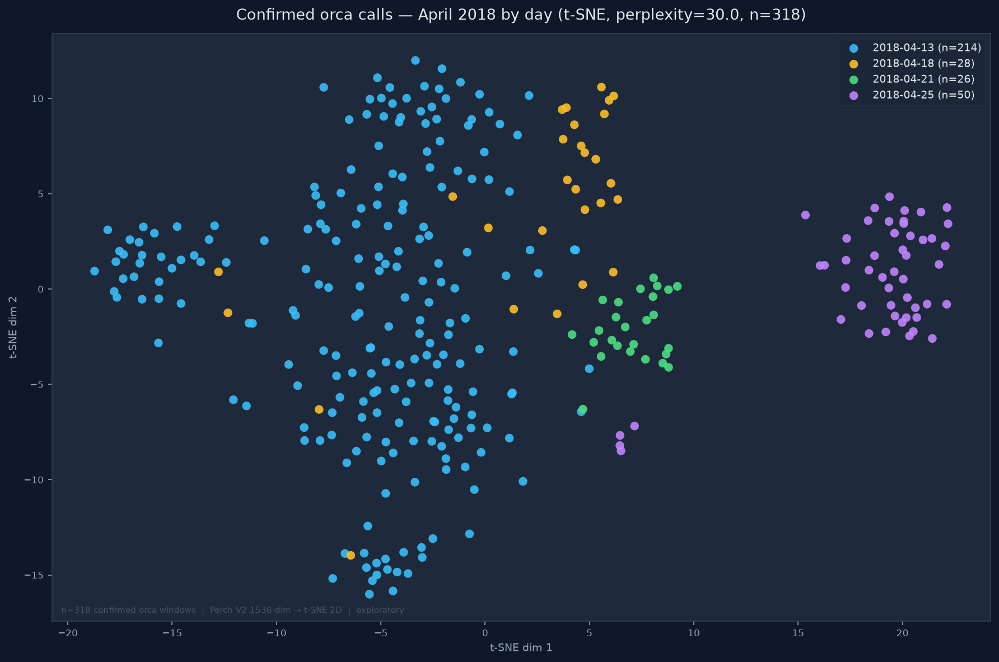
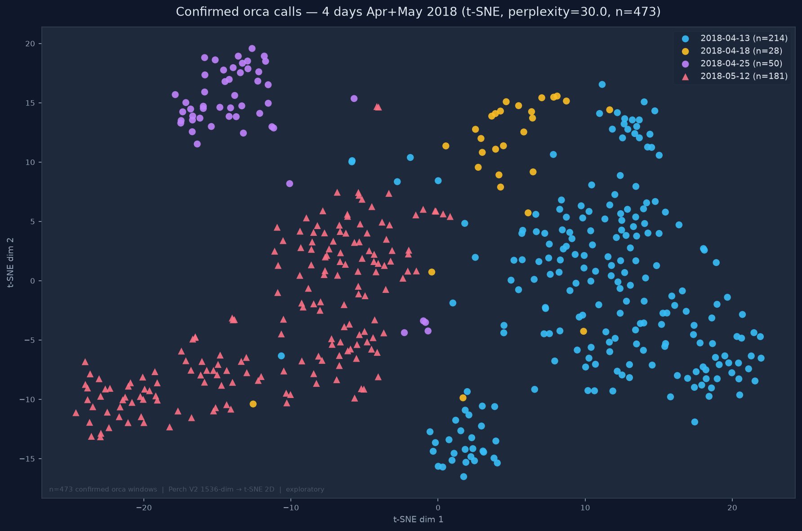
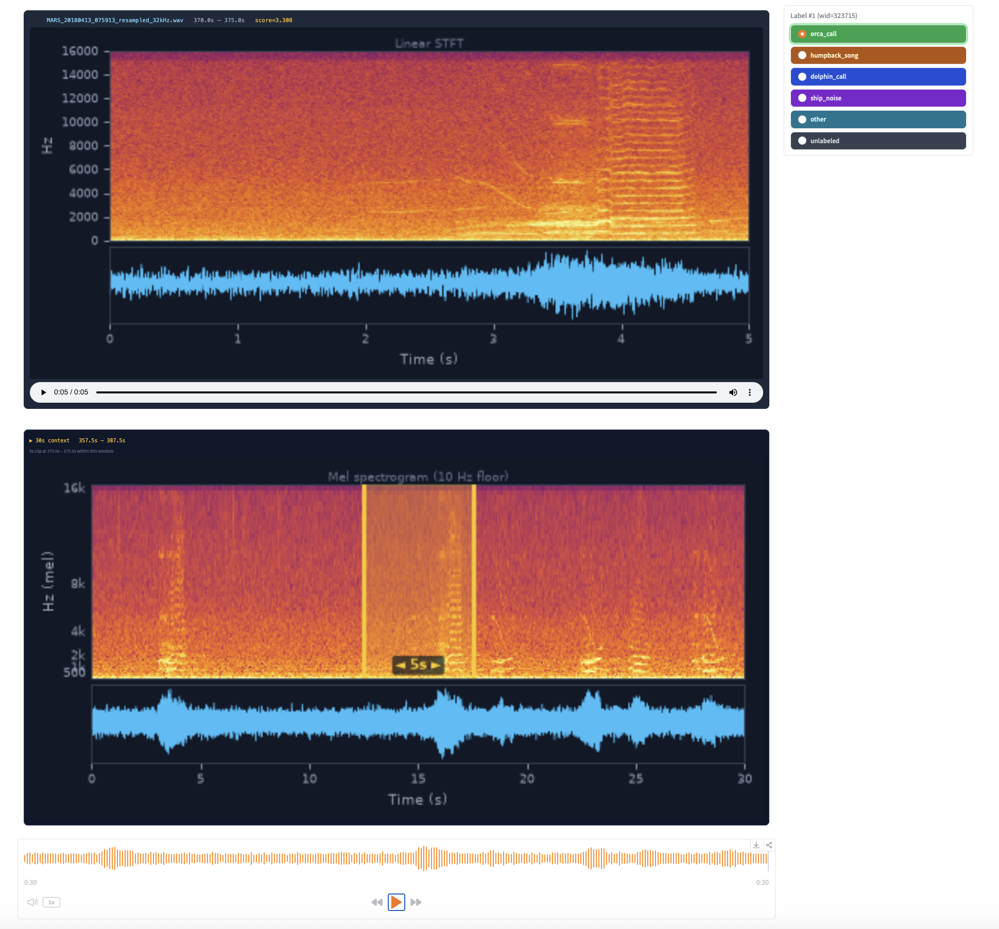
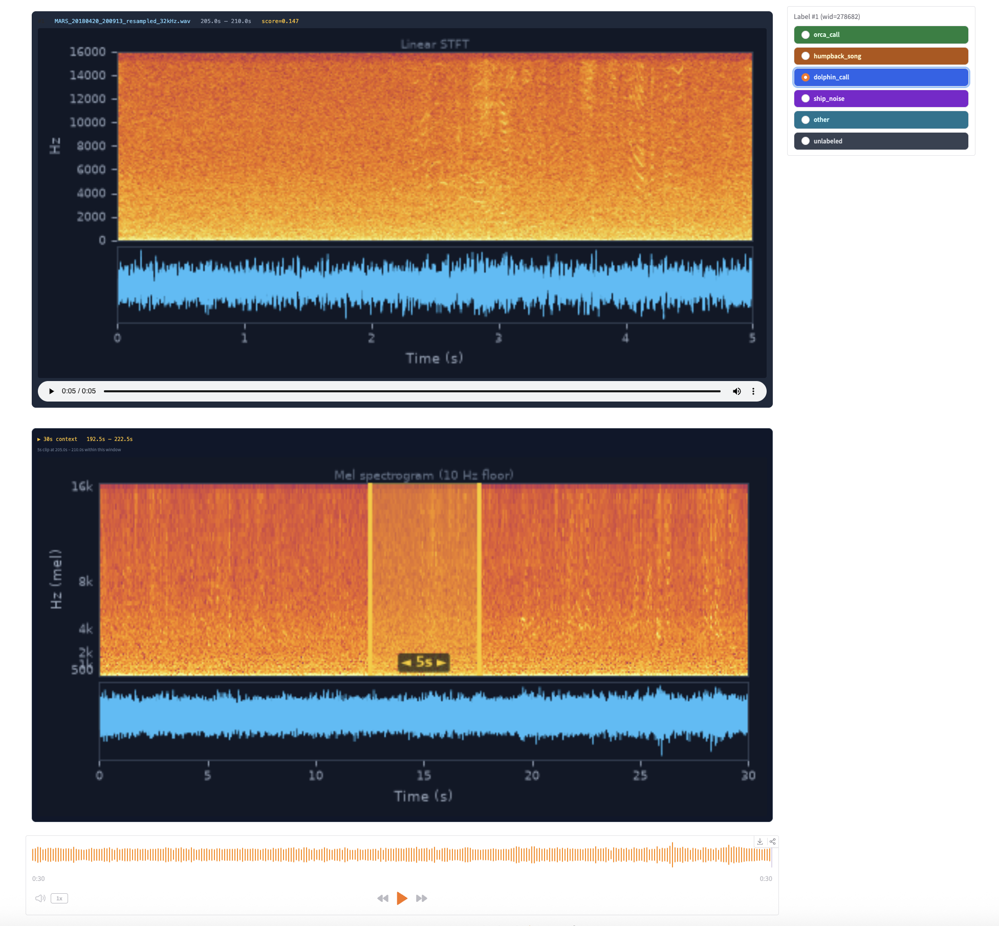

# Perch Hoplite Marine Bioacoustics Pipeline
## MBARI — NVIDIA DGX SPARC (spark-ae0e, spark-0626)

---
## Overview

Built on Google perch-hoplite https://github.com/google-research/perch-hoplite. Updated to run pure PyTorch and Python, no TensorFlow, and to use the Perch V2 embedding model reimplemented in pure PyTorch and Python (no TensorFlow) (https://github.com/duane-edgington/perch-pytorch).

https://github.com/google-research/perch/blob/main/chirp/projects/whale_demo/agile_modeling_noaa_demo.ipynb

> "Hoplite is a system for storing large volumes of embeddings from machine
> perception models. We focus on combining vector search with active learning
> workflows, aka [agile modeling](https://arxiv.org/abs/2505.03071).
>
> In brief, agile modeling is a process for rapidly developing classifiers using
> embeddings from a pre-trained 'foundation' model. For bioacoustics work, we
> find that new classifiers can often be developed for new signals in under
> an hour.
>
> **How does it work?**
>
> We first use a bioacoustics model to convert the unlabeled audio data into
> embeddings - these are like semantic 'fingerprints' of 5-second audio clips.
> Then, you can search the embeddings of your data by providing an example of
> what you're looking for. You then give feedback on the results - which examples
> are and are not what you're looking for. From this feedback, we can quickly
> train a classifier. You can then improve on the classifier with
> active learning: Examine the classifier outputs, provide more feedback, and
> re-train the classifier.
>
> A key feature of this workflow is that we pre-compute the embeddings. This
> may take a while if you have a large amount of data, but the subsequent search
> and classifier training is very efficient."

*— Google Research, [perch-hoplite](https://github.com/google-research/perch-hoplite)*

https://research.google/blog/how-ai-trained-on-birds-is-surfacing-underwater-mysteries/ 

https://arxiv.org/abs/2512.03219 https://arxiv.org/abs/2508.04665 


## System Overview

| Machine | Role | IP / Access |
|---|---|---|
| **Mac workstation** | Developer workstation | Local — scp gateway to spark |
| **spark-ae0e** | Embedding, active learning, inference, Gradio server | 134.89.11.107 |
| **spark-0626** | Spare / parallel runs | 134.89.11.174 |

### Why the split?

The spark servers have NVIDIA GB10 (Blackwell, compute capability 12.1) GPUs.
**July 2026:** The pipeline runs entirely on spark-ae0e. No Google Drive, no internet required for embedding. See `clean_install.sh` for setup.

| | spark-ae0e | spark-0626 |
|---|---|---|
| IP address | 134.89.11.107 | 134.89.11.174 |
| PAM_Analysis | /mnt/PAM_Analysis (NFS4, rw) | /mnt/PAM_Analysis (NFS4, rw) |
| PAM_Archive | /mnt/PAM_Archive (NFS4, rw) | /mnt/PAM_Archive (NFS4, rw) |
| NFS server | thalassa.shore.mbari.org | thalassa.shore.mbari.org |
| Python venv | ~/perch-hoplite/venv | unified TF-free environment |
| perch-hoplite | 1.0.1 | 1.0.1 |

Both spark machines share the same NFS volumes. Databases, models, results,
and labels written on one are immediately visible on the other.

---

## Directory Structure

```
spark-ae0e / spark-0626 (NFS shared)
/mnt/PAM_Analysis/perch-hoplite/
    db/                             ← Hoplite embedding databases
        MARS_20180413_20180413_32kHz/   ← April 13 2018 (144 files, 17,280 embeddings)
    models/                         ← trained classifiers (.pt + .metrics.json)
        orca_v1.pt                  ← first classifier, ROC-AUC 0.754
    results/                        ← inference CSVs, score histogram PNGs
    labels/                         ← annotation CSVs (bootstrap + active learning)
    queries/
        cetaceans/                  ← orca, dolphin, whale reference clips
        anthropogenic/              ← boat, ROV, sonar reference clips
    logs/                           ← persistent logs

/mnt/PAM_Analysis/GoogleMultiSpeciesWhaleModel2/
    resampled_32kHz/                ← source audio resampled to 32 kHz
        2018/04/                    ← MARS recordings April 2018

/mnt/PAM_Archive/                   ← RAW AUDIO (read-only, 273 TB)
    2015/ 2016/ ... 2026/
```

---

## Installation Status (spark-ae0e as of July 2026)

Already installed in venv — do not reinstall:

Activate: `source ~/perch-hoplite/venv/bin/activate`

```
torch                2.12.1+cu130
perch-hoplite        1.0.1
gradio               6.15.1
soundfile            0.13.1
librosa              0.11.0
scipy
matplotlib
scikit-learn
ml_collections
timm
```

Known harmless warnings at startup (not errors):
- `NUMA node read from SysFS had negative value` — BIOS topology quirk, harmless.
- `Failed to load class list ... duplicate entries` — cosmetic, does not affect embeddings.

---

## Programs

| File | Runs on | Purpose |
|---|---|---|
| `phase1_embed_torch.py` | **spark-ae0e** | Build Hoplite embedding DB from audio (PyTorch, no Colab) |
| `phase2_classify.py` | **spark-ae0e** | Active learning: search, label, train, review, infer |
| `tools/plot_monthly.py` | **spark-ae0e** | Monthly detection timeline and heatmap plots |
| `tools/plot_tsne.py` | **spark-ae0e** | t-SNE visualization of labeled embeddings |
| `tools/run_orca_validation.sh` | **spark-ae0e** | Multi-month v4 orca inference for cross-month validation |
| `tools/score_orca_regions.py` | **spark-ae0e** | Threshold-swept orca detection counts vs known ground-truth regions |
| `tools/plot_tsne_orca_by_day.py` | **spark-ae0e** | t-SNE of confirmed orca colored by day (`--style analysis`/`presentation`) |
| `tools/orca_day_recording_spread.py` | **spark-ae0e** | Per-day distinct-recording confound check for by-day clusters |
| `tools/archive_tsne_by_day.sh` | **spark-ae0e** | Generate + register the perplexity × style t-SNE matrix (12 figures) |

---

## Embedding Visualization — t-SNE

### Two-Season t-SNE — April 2018 + October 2020



*778 labeled embeddings from two seasons. Orca (green), humpback (orange), dolphin (purple), ship noise (cyan), and background (gray) form well-separated clusters, confirming that Perch V2 embeddings generalize across seasons.*

### Three-Season t-SNE — April 2018 + October 2020 + April 2026



*823 labeled embeddings from three seasons (July 2026). Orca (green) forms a tight cohesive cluster consistent across all three seasons. The 25 April 2026 humpback hard-negatives (orange) land within the main humpback cluster — confirming correct labels. Ship noise (cyan) and background (gray) are tightly isolated. The humpback/orca overlap in the upper-center region explains the persistent false positive challenge.*
### By-Day Orca t-SNE — Extended April 2018 Activity (July 19 2026)



*292 confirmed orca_call embeddings from April 2018, colored by confirmed day (Apr 13 / 18 / 25). **Apr 25 (n=50) forms a distinct cluster separated from the Apr 13 Bigg's event (n=214) within the same month** — robust across t-SNE perplexity 10/30/50, spanning 10 recordings over a ~3.5 h evening encounter (not a single-recording artifact). Consistent with a different pod / individual / call-type. Apr 18 (n=28) is partially distinct.*



*473 confirmed orca_call embeddings across four confirmed days incl. May 12 2018 (pink triangles, n=181). May's separation is real but cross-month — confounded by recording conditions, so not interpreted biologically. Apr 25 again holds a distinct corner. Exploratory: t-SNE distances/sizes are not meaningful.*

**Why the Apr 25 separation is trusted (confound checks):** it is same-month (rules out season/background); its windows span many recordings across the day (`tools/orca_day_recording_spread.py` — Apr 13: 214 windows / 13 files, morning · Apr 18: 28 / 5, late-morning · Apr 25: 50 / 10, **evening** · May 12: 181 / 15, morning); and it is stable across perplexity 10/30/50 (all three settings × both styles archived by `tools/archive_tsne_by_day.sh`). Interpretation (pod vs individual vs call-type vs an evening-vs-morning acoustic context) is pending direct expert listening — Perch V2 embeds *species* and collapses within-orca variation, so this is a strong lead, not proof.

**Candidate biological explanation:** KSBW news reported two distinct pods in Monterey Bay spring 2018 — one Alaskan, one Californian (the CA140s, "Emma's pod"). Different pods carry different call repertoires, a plausible reason the days separate in embedding space. Consistent with, not proof of, the separation (detections aren't yet assigned to pods; morning-vs-evening context remains a confound). It reframes "the calls look different" into a testable question: do the separating clusters correspond to the two known pods?

| `tools/merge_dbs.py` | **spark-ae0e** | Merge two Hoplite DBs (SQLite + USearch index) |
| `tools/merge_annotations.py` | **spark-ae0e** | Copy annotations between DBs |
| `tools/extract_example_clips.py` | **spark-ae0e** | Extract and peak-normalize 10 example clips |
| `tools/review_example_clips.py` | **spark-ae0e** | Launch Gradio review for example clips |

---

## Orca Cross-Month Validation

Validate a classifier's orca detector against months with known ground truth
(confirmed events, confirmed-silent periods) and pick an operating threshold.

```bash
# 1. Run v4 inference over the four ground-truth months (walk away; ~30 min/month).
#    Writes per-month detection CSVs to results/ at a low floor (0.0) so the scorer
#    can sweep thresholds without re-running inference.
nohup bash tools/run_orca_validation.sh \
    > /mnt/PAM_Analysis/perch-hoplite/logs/orca_validation.log 2>&1 &

# 2. Score detections against known regions across a threshold ladder.
python3 tools/score_orca_regions.py \
    --results-dir /mnt/PAM_Analysis/perch-hoplite/results \
    --by-day \
    --out-summary /mnt/PAM_Analysis/perch-hoplite/results/orca_region_scores_v4.csv
```

The scorer reports, per known region and per threshold, the orca detection count:
PRESENT regions (confirmed events, e.g. Apr 13 / May 12 2018) should retain
detections as the threshold rises; ABSENT regions (confirmed silent, e.g. Oct 2020,
April 2026) are all false positives and should collapse toward 0. Edit `REGIONS` in
the script as expert review firms up. Note the inference CSV is per-label (one row per
window per class), so read ABSENT regions at higher thresholds — the 0.0 column is
inflated by also-ran windows. Current operating threshold: **+1.16** (v4 F1-optimal),
**+1.5** conservative.

---

## Complete Workflow

### Phase 1 — Build the Embedding Database

**New (July 2026): Native PyTorch pipeline runs entirely on spark-ae0e.**
No Colab, no Google Drive, no internet required.

```bash
source ~/perch-hoplite/venv/bin/activate

# Embed a single day
python3 phase1_embed_torch.py \\
    --audio-dir /mnt/PAM_Analysis/GoogleMultiSpeciesWhaleModel2/resampled_32kHz/2018/04 \\
    --date 20180413 \\
    --db-dir /mnt/PAM_Analysis/perch-hoplite/db/MARS_20180413_torch_32kHz \\
    --device cuda --compile

# Embed a full month (~37 min for 30 days)
python3 phase1_embed_torch.py \\
    --audio-dir /mnt/PAM_Analysis/GoogleMultiSpeciesWhaleModel2/resampled_32kHz/2018/04 \\
    --db-dir /mnt/PAM_Analysis/perch-hoplite/db/MARS_20180401_20180430_32kHz \\
    --device cuda --compile
```

---

### Phase 2 — Active Learning Loop (spark-ae0e)

All Phase 2 steps run on spark-ae0e. The Gradio labeling GUI is accessed
from any browser on the MBARI network.

#### Step 2 — Import bootstrap labels (optional)

If you have existing annotations from Raven Pro, PAMGuard, or the Google
species model score CSVs, import them first:

```bash
# From Google model score CSVs
python3 convert_scores_to_labels.py \
    --scores-dir /mnt/PAM_Analysis/GoogleMultiSpeciesWhaleModel2/scores_gpu/ \
    --output-csv /mnt/PAM_Analysis/perch-hoplite/labels/bootstrap_orca.csv \
    --target-class orca_call \
    --threshold 0.7

# Import into DB
python3 phase2_classify.py label \
    --db-dir /mnt/PAM_Analysis/perch-hoplite/db/MARS_20180413_20180413_32kHz \
    --labels-csv /mnt/PAM_Analysis/perch-hoplite/labels/bootstrap_orca.csv \
    --annotator-id duane
```

#### Step 3 — Train initial classifier

```bash
python3 phase2_classify.py train \
    --db-dir /mnt/PAM_Analysis/perch-hoplite/db/MARS_20180413_20180413_32kHz \
    --classifier-out /mnt/PAM_Analysis/perch-hoplite/models/orca_v1.pt \
    --num-steps 256
```

Metrics are printed after training and saved to `orca_v1.metrics.json`.
Target ROC-AUC > 0.90 before running full inference.

#### Step 4 — Review and label (active learning)

Launch the Gradio labeling GUI on spark, open in any browser on the MBARI network:

```bash
# On spark-ae0e
nohup python3 phase2_classify.py review \
    --db-dir /mnt/PAM_Analysis/perch-hoplite/db/MARS_20180413_20180413_32kHz \
    --classifier /mnt/PAM_Analysis/perch-hoplite/models/orca_v1.pt \
    --target-label orca_call \
    --num-results 50 \
    --sample-size 5000 \
    --audio-dir /mnt/PAM_Analysis/GoogleMultiSpeciesWhaleModel2/resampled_32kHz/2018/04 \
    --serve --port 7860 \
    > /mnt/PAM_Analysis/perch-hoplite/logs/review_7860.log 2>&1 &
```

**`--audio-dir` is required** — this flag sets the audio path for the Gradio GUI.

Open in browser: **http://134.89.11.107:7860**

The GUI shows the top-50 highest-scoring candidates with:
- Spectrogram (0–16 kHz, log-power, inferno colormap)
- Waveform
- Custom audio player with high-contrast progress bar
- Multi-class colored radio buttons (up to 6 named classes + unlabeled)

Audio is automatically normalized to −3 dBFS for comfortable listening
(the resampled MARS files have very low amplitude at native levels).

**Labeling strategy (multi-class):**

Each clip is assigned to exactly one class. There is no generic "negative" —
instead every sound type gets its own label, making the classifier richer:

- `orca_call` 🟢 — orca call clearly present: banded harmonics 1–6 kHz
- `humpback_song` 🟡 — humpback song units: complex harmonics 100 Hz–4 kHz
- `dolphin_call` 🟣 — Pacific white-sided dolphin burst pulses: dense vertical striping 2–14 kHz
- `ship_noise` 🩵 — vessel engine: regular low-frequency pulsing
- `other` 🟠 — any clearly structured sound that doesn't fit the above (ROV, unknown bio)
- `unlabeled` ⬛ — genuinely ambiguous or too faint to identify — skip, do not save

**Decision guidelines:**
- If you can see or hear clear call structure leaning toward one class (≥60% confident) → label it
- If the UTC timestamp is in a known active window for a species → use that as a prior
- If truly 50/50 between two classes → use `unlabeled`
- Trust the spectrogram over your ears for faint calls
- `other` is for sounds with clear structure that don't match any named class
- Never use `other` for background/silence — those should be `unlabeled` or simply not reviewed

Pass the class list at launch time with `--classes`:
```bash
--classes orca_call,humpback_song,dolphin_call,ship_noise,other,unlabeled
```

Click **💾 Save Labels to DB** when done. The status box confirms save counts per class.

To monitor the server:
```bash
tail -f /mnt/PAM_Analysis/perch-hoplite/logs/review_7860.log
```

To stop the server:
```bash
pkill -f "phase2_classify.py review"
```

#### Step 5 — Retrain with new labels

⚠️ **Always kill the Gradio review server before training.** The review server
holds several GB of GPU memory. Training will fail with `cudaSetDevice() out of memory`
if both run simultaneously.

```bash
pkill -f "phase2_classify.py review"
```

```bash
nohup python3 phase2_classify.py train \
    --db-dir /mnt/PAM_Analysis/perch-hoplite/db/MARS_20180413_20180413_32kHz \
    --classifier-out /mnt/PAM_Analysis/perch-hoplite/models/orca_v2.pt \
    --num-steps 256 \
    > /mnt/PAM_Analysis/perch-hoplite/logs/train_orca_v2.log 2>&1 &
tail -f /mnt/PAM_Analysis/perch-hoplite/logs/train_orca_v2.log
```

```bash
nohup python3 phase2_classify.py train \
    --db-dir /mnt/PAM_Analysis/perch-hoplite/db/MARS_20180413_20180413_32kHz \
    --classifier-out /mnt/PAM_Analysis/perch-hoplite/models/orca_v9.pt \
    --num-steps 256 \
    --train-ratio 0.8 \
    > /mnt/PAM_Analysis/perch-hoplite/logs/train_orca_v9.log 2>&1 &
sleep 5 && tail -f /mnt/PAM_Analysis/perch-hoplite/logs/train_orca_v9.log
```


Repeat Steps 4–5 until ROC-AUC is satisfactory. Increment the version number
(`orca_v2.pt`, `orca_v3.pt`, ...) to preserve each iteration.

For margin sampling (finding hard negatives near the decision boundary):
```bash
nohup python3 phase2_classify.py review \
    --db-dir /mnt/PAM_Analysis/perch-hoplite/db/MARS_20180413_20180413_32kHz \
    --classifier /mnt/PAM_Analysis/perch-hoplite/models/orca_v2.pt \
    --target-label orca_call \
    --num-results 50 \
    --sample-size 17280 \
    --margin-target-score 0.0 \
    --audio-dir /mnt/PAM_Analysis/GoogleMultiSpeciesWhaleModel2/resampled_32kHz/2018/04 \
    --serve --port 7860 \
    > /mnt/PAM_Analysis/perch-hoplite/logs/review_7860.log 2>&1 &
```

#### Step 6 — Check label counts at any time

```bash
python3 phase2_classify.py stats \
    --db-dir /mnt/PAM_Analysis/perch-hoplite/db/MARS_20180413_20180413_32kHz
```

#### Step 7 — Full inference → detections CSV

```bash
python3 phase2_classify.py infer \
    --db-dir /mnt/PAM_Analysis/perch-hoplite/db/MARS_20180413_20180413_32kHz \
    --classifier /mnt/PAM_Analysis/perch-hoplite/models/orca_v2.pt \
    --output-csv /mnt/PAM_Analysis/perch-hoplite/results/MARS_20180413_orca_detections.csv \
    --logit-threshold 0.0 \
    --plot-distribution /mnt/PAM_Analysis/perch-hoplite/results/MARS_20180413_orca_logit_dist.png
```

### Step 8 - Review detections produced by perch-hoplite system

```bash
nohup python3 phase2_classify.py review     --db-dir /mnt/PAM_Analysis/perch-hoplite/db/MARS_20180413_20180413_32kHz     --classifier /mnt/PAM_Analysis/perch-hoplite/models/orca_v9.pt     --target-label orca_call     --detections-csv /mnt/PAM_Analysis/perch-hoplite/results/MARS_20180413_orca_v9_detections.csv     --num-results 25     --detections-offset 1     --classes orca_call,dolphin_call,other,unlabeled     --audio-dir /mnt/PAM_Analysis/GoogleMultiSpeciesWhaleModel2/resampled_32kHz/2018/04     --serve --port 7860     > /mnt/PAM_Analysis/perch-hoplite/logs/review_7860.log 2>&1 &
```

### optional Step 8 — Review detections with mel spectrogram and colormap options

`phase2_classify_logmel.py` is retired — use `phase2_classify.py` with
`--spectrogram-type` and `--colormap` flags instead:

```bash
nohup python3 phase2_classify.py review \
    --db-dir /mnt/PAM_Analysis/perch-hoplite/db/MARS_20180401_20180430_32kHz_norm \
    --classifier /mnt/PAM_Analysis/perch-hoplite/models/orca_v2.pt \
    --target-label orca_call \
    --num-results 25 \
    --detections-offset 0 \
    --classes orca_call,humpback_song,dolphin_call,ship_noise,other,unlabeled \
    --audio-dir /mnt/PAM_Analysis/GoogleMultiSpeciesWhaleModel2/resampled_32kHz/2018/04 \
    --spectrogram-type mel --colormap viridis \
    --serve --port 7861 \
    > /mnt/PAM_Analysis/perch-hoplite/logs/review_7861.log 2>&1 &
```

Colormap options: `viridis` (preferred), `gray`, `gray_r`, `inferno`, `magma`.
Spectrogram options: `linear` (default, best for orca/dolphin), `mel` (best for humpback), `perch`, `pcen`.

**`--detections-offset`** pages through detections in batches of `--num-results`.
Increment by `--num-results` (here 25) to review the next batch:

| `--detections-offset` | Detections shown |
|---|---|
| 0 | 1 – 25 (first batch, default) |
| 25 | 26 – 50 |
| 50 | 51 – 75 |
| 200 | 201 – 225 |

Restart Gradio with the new offset to review the next batch. Labels are
saved to the DB on every click — restarting is safe.

---

## Full-Archive Campaign Pipeline (added Sep 2026)

After the classifier reaches production quality (v4, ROC-AUC 0.959), the workflow
shifts from development to systematic detection across the full archive. Each month
requires the following steps in order. Both sparks are used in parallel:
spark-0626 for resampling (I/O-bound), spark-ae0e for GPU work.

### Step 0 — Resample one month from the PAM Archive

Run on **spark-0626** (I/O-bound; frees ae0e GPU for embedding):

```bash
cd ~/perch-hoplite && git pull
nohup ./tools/resample_sox_32k_batched_vol.sh 2016 03 1 31 8 \
  > /mnt/PAM_Analysis/perch-hoplite/logs/resample_32kHz_2016_03.log 2>&1 &

sleep 10 && head -5 /mnt/PAM_Analysis/perch-hoplite/logs/resample_32kHz_2016_03.log
```

**CRITICAL:** Confirm the banner reads `Starting (vol 3): YYYY-MM` before walking
away. The `vol 3` (SoX volume amplification factor 3) is mandatory — without it,
the low-amplitude MARS recordings produce nearly empty windows that the classifier
cannot score reliably.

Expected: ~144 files/day × 31 days = ~4,464 files, ~4.5 hours, ~160 GB.

### Step 1 — Coverage histogram (Stage 1.5)

Run on either spark after resampling completes:

```bash
python3 tools/coverage_histogram.py \
    --audio-dir /mnt/PAM_Analysis/GoogleMultiSpeciesWhaleModel2/resampled_32kHz/2016/03 \
    --out results/coverage/2016-03_coverage.csv
```

This produces a per-day effort table, flags absent days, overlaps, and recorder
gaps, and computes the **TRUE expected window count** using the confirmed adapter
rule `max(1, floor(duration/5))` — NOT `ceil()`. Commit the CSV immediately:

```bash
git add results/coverage/2016-03_coverage.csv
git commit -m "results: Mar 2016 coverage — XX.X%, NNNNNN windows"
git push origin main
```

The coverage CSV is the reconciliation target for the embed audit in Step 3.

### Step 2 — Embed on spark-ae0e (GPU)

Check GPU is free first — always:

```bash
nvidia-smi | tail -4   # must show "No running processes found"
```

Then embed the full month:

```bash
source ~/perch-pytorch/venv/bin/activate   # GPU/embed venv

nohup python3 phase1_embed_torch.py \
    --audio-dir /mnt/PAM_Analysis/GoogleMultiSpeciesWhaleModel2/resampled_32kHz/2016/03 \
    --db-dir /mnt/PAM_Analysis/perch-hoplite/db/MARS_20160301_20160331_32kHz_norm \
    --device cuda --compile \
    > /mnt/PAM_Analysis/perch-hoplite/logs/embed_mar2016_norm.log 2>&1 &

sleep 45 && tail -5 /mnt/PAM_Analysis/perch-hoplite/logs/embed_mar2016_norm.log
```

Expected: ~35-40 minutes, ~225 windows/sec, ~520,000 windows for a full month.

### Step 3 — Audit window counts

Verify the DB matches the floor rule exactly:

```bash
python3 tools/audit_window_counts.py \
    --audio-dir /mnt/PAM_Analysis/GoogleMultiSpeciesWhaleModel2/resampled_32kHz/2016/03 \
    --db /mnt/PAM_Analysis/perch-hoplite/db/MARS_20160301_20160331_32kHz_norm/hoplite.sqlite
```

Expected output: `Difference : +0`. Discrepancies of +1 per file (fractional-second
boundary cases) are documented and harmless. Discrepancies of +N where N > number
of files indicate a genuine problem — re-embed.

### Step 4 — Inference with both canonical models

```bash
DB=/mnt/PAM_Analysis/perch-hoplite/db/MARS_20160301_20160331_32kHz_norm
R=/mnt/PAM_Analysis/perch-hoplite/results

for model in v4 v10; do
  python3 phase2_classify.py infer \
    --db-dir $DB \
    --classifier /mnt/PAM_Analysis/perch-hoplite/models/orca_${model}.pt \
    --labels orca_call --logit-threshold 0.0 \
    --output-csv $R/MARS_20160301_20160331_${model}_orcaval.csv
done

wc -l $R/MARS_20160301_20160331_v4_orcaval.csv \
       $R/MARS_20160301_20160331_v10_orcaval.csv
```

Use logit-threshold 0.0 (not the operating threshold) so the full score
distribution is captured for band-table analysis in Step 5.

### Step 5 — Band table and date distribution

```bash
# Which dates have anything above the operating threshold?
awk -F, 'NR>1 && $6=="orca_call" && $7>=2.31 {print substr($3,6,8)}' \
  $R/MARS_20160301_20160331_v10_orcaval.csv | sort | uniq -c | sort -rn | head -15

# Score band table
f=$R/MARS_20160301_20160331_v10_orcaval.csv
for lohi in "3.00:99" "2.31:3.00" "1.00:2.31" "0.00:1.00"; do
  lo="${lohi%%:*}"; hi="${lohi##*:}"
  printf "  [%s-%s): %s\n" "$lo" "$hi" \
    "$(awk -F, -v lo=$lo -v hi=$hi 'NR>1 && $6=="orca_call" && $7>=lo && $7<hi' $f | wc -l)"
done
```

If zero windows are above the operating threshold (v10 ≥ 2.31), the month is
acoustically silent — no review needed. If dates cluster on 1-3 days with high
scores, there is an encounter worth reviewing.

### Step 6 — Build the pass-1 review set

**Operating thresholds (confirmed):** v4 ≥ 1.16, v10 ≥ 2.31. The union of both:

```bash
cd $R
python3 ~/perch-hoplite/tools/build_pass2.py \
    --scores MARS_20160301_20160331_v10_orcaval.csv \
    --dates 20160312 20160318 \
    --min-score 2.31 \
    --out review_mar2016_pass1.csv
wc -l review_mar2016_pass1.csv
```

For the initial pass-1, `--min-score 2.31` (v10 operating threshold) is appropriate.
The `--dates` argument restricts to dates where above-threshold windows were found
in Step 5 — do not include all 31 days.

Review sets > 25 clips should be split into 25-clip chunks to allow breaks:

```bash
python3 -c "
import csv
rows=list(csv.reader(open('review_mar2016_pass1.csv')))
h=rows[0]; data=rows[1:]
for i,chunk in enumerate([data[j:j+25] for j in range(0,len(data),25)],1):
    f=f'review_mar2016_pass1_chunk{i}.csv'
    csv.writer(open(f,'w',newline='')).writerows([h]+chunk)
    sc=[float(r[6]) for r in chunk]
    print(f'chunk{i}: {len(chunk)} clips  scores {min(sc):.2f}-{max(sc):.2f}')
"
```

### Step 7 — Gradio review (pass 1)

**venv note for spark-0626:** Gradio requires `perch-hoplite` venv, NOT
`perch-pytorch`. Switch explicitly:

```bash
source ~/perch-hoplite/venv/bin/activate   # Gradio review venv (spark-0626)
# OR
source ~/perch-pytorch/venv/bin/activate   # GPU/embed venv (spark-ae0e, where venvs are unified)
```

Launch the review server:

```bash
nohup python3 ~/perch-hoplite/phase2_classify.py review \
    --db-dir /mnt/PAM_Analysis/perch-hoplite/db/MARS_20160301_20160331_32kHz_norm \
    --classifier /mnt/PAM_Analysis/perch-hoplite/models/orca_v10.pt \
    --target-label orca_call \
    --detections-csv $R/review_mar2016_pass1_chunk1.csv \
    --detections-offset 0 --num-results 25 \
    --classes orca_call,humpback_song,dolphin_call,ROV_noise,ship_noise,other,unlabeled \
    --annotator-id duane \
    --audio-dir /mnt/PAM_Analysis/GoogleMultiSpeciesWhaleModel2/resampled_32kHz/2016/03 \
    --spectrogram-type mel --colormap viridis \
    --serve --port 7878 \
    > /mnt/PAM_Analysis/perch-hoplite/logs/review_mar2016_pass1_chunk1.log 2>&1 &

sleep 5 && tail -3 /mnt/PAM_Analysis/perch-hoplite/logs/review_mar2016_pass1_chunk1.log
```

Access at: **http://134.89.11.107:7878** (ae0e) or **http://134.89.11.174:7878** (0626)

**MANDATORY safety checks before labeling:**
1. Confirm `nvidia-smi` shows no running processes before launch
2. Check the Gradio header shows the expected filename/date — a crashed prior server
   leaves the browser connected to the old session. Labels then go to the WRONG DB.
3. Save every 8-10 clips — autosave does NOT survive a VPN drop or connection loss.

To kill a running server: `pkill -f "port 7878"`

### Step 8 — Pass-2 zoom-in (sub-threshold)

After pass-1 confirms an encounter, run pass-2 to recover calls below the operating
threshold that nonetheless fall within the known encounter window. This step
typically recovers the majority of real calls — pass-1 recall at the operating
threshold is ~17%.

```bash
python3 ~/perch-hoplite/tools/build_pass2.py \
    --scores $R/MARS_20160301_20160331_v10_orcaval.csv \
    --dates 20160312 20160318 \
    --exclude-db /mnt/PAM_Analysis/perch-hoplite/db/MARS_20160301_20160331_32kHz_norm/hoplite.sqlite \
    --min-score 0.20 \
    --out $R/review_mar2016_pass2.csv
wc -l $R/review_mar2016_pass2.csv
```

The `--exclude-db` flag excludes already-reviewed windows. The `--min-score 0.20`
floor avoids genuinely empty windows while capturing the sub-threshold signal.
Split into 25-clip chunks as in Step 6 and review with Gradio.

**Stopping rule:** stop pass-2 when the orca confirmation rate drops to near zero
across an entire chunk, OR when all windows at scores ≥ ~1.5 have been reviewed.
Below 1.5, humpback interference makes the acoustic scene too complex to efficiently
recover additional orca calls.

### Step 9 — Get timestamps from DB and commit

After review, pull authoritative timestamps from the DB for any analysis:

```bash
python3 -c "
import sqlite3, struct
from datetime import datetime, timedelta
db='/mnt/PAM_Analysis/perch-hoplite/db/MARS_20160301_20160331_32kHz_norm/hoplite.sqlite'
off=-7   # PDT after Mar 13; PST before
con=sqlite3.connect(db)
rows=con.execute('SELECT r.filename,a.offsets FROM annotations a JOIN recordings r ON r.id=a.recording_id WHERE a.label=\"orca_call\"').fetchall()
for fn,blob in rows:
    s=struct.unpack('<2d',blob)[0] if blob else 0.0
    t=datetime.strptime(fn[5:20],'%Y%m%d_%H%M%S')+timedelta(seconds=s)+timedelta(hours=off)
    print(f'{t.day},{t.hour+t.minute/60:.3f}')
"
```

**TIME BASE — mandatory:** Our timestamps are UTC; all sighting records are LOCAL
(PDT=UTC-7 March 13–November; PST=UTC-8 otherwise). Converting UTC→local is not
cosmetic — it moves encounters across date boundaries and changes the day/night
classification. Always convert before any sighting correlation.

Commit inference CSVs to the repo:

```bash
cd ~/perch-hoplite
cp $R/MARS_20160301_20160331_v{4,10}_orcaval.csv results/
git add results/MARS_20160301_20160331_v4_orcaval.csv \
        results/MARS_20160301_20160331_v10_orcaval.csv
git commit -m "results: Mar 2016 — inference complete; N orca confirmed"
git push origin main
```

### Step 10 — Diel analysis and sighting correlation

Generate the time-of-day diel scatter with per-day civil twilight shading:

```bash
python3 tools/plot_diel_vs_sightings.py \
    --db /mnt/PAM_Analysis/perch-hoplite/db/MARS_20160301_20160331_32kHz_norm/hoplite.sqlite \
    --year 2016 --month 3 --utc-offset -7 \
    --title "March 2016" \
    --sighting 15 11 12 --sighting 22 14 8 \
    --out figures/panel_march2016.png
```

Sighting data (MBWW / CKWP) is passed via `--sighting DAY HOUR COUNT` so no
copyrighted data enters the repo. The tool reads confirmed calls from the DB
directly — no hand-transcription.

**⚠️ Sighting data copyright:** MBWW monthly sighting lists are © Nancy Black.
Do NOT commit the sighting data or derived tables to this PUBLIC repo without
written permission. The diel figures which plot MBWW counts are INTERNAL ONLY.

### Step 11 — Delete resampled WAV after all findings are committed

```bash
# Verify everything is committed first
git status  # must be clean

# List what would be deleted (dry run)
find /mnt/PAM_Analysis/GoogleMultiSpeciesWhaleModel2/resampled_32kHz/2016/03 \
    -name "*.wav" | wc -l

# Then delete (only after explicit go-ahead)
# find ... -delete
```

The permanent artifact is the embedding DB (~1.6 GB/month). The resampled WAV
(~160 GB/month) is regenerable from the PAM Archive and should be deleted once
the month's findings are committed, to free thalassa space.

---

## Venv Reference (spark-0626 specific)

spark-0626 has two separate venvs with different capabilities:

| Task | Venv | Activate |
|---|---|---|
| Embed, inference (GPU) | `perch-pytorch` | `source ~/perch-pytorch/venv/bin/activate` |
| Gradio review, tools | `perch-hoplite` | `source ~/perch-hoplite/venv/bin/activate` |

spark-ae0e uses a unified venv (`~/perch-pytorch/venv`) for all tasks.

---

## Tools added since July 2026

| Tool | Purpose |
|---|---|
| `tools/resample_sox_32k_batched_vol.sh` | Canonical resampler — SoX vol 3, 32kHz, N parallel jobs |
| `tools/coverage_histogram.py` | Per-day effort, outage detection, TRUE expected windows |
| `tools/audit_window_counts.py` | Verify DB window count matches floor rule post-embed |
| `tools/build_pass2.py` | Build score-sorted, date-filtered, already-reviewed-excluded review set |
| `tools/label_summary.py` | Per-day confirmed labels + exact UTC timestamps from DB |
| `tools/plot_diel_vs_sightings.py` | Time-of-day scatter with per-day civil twilight (NOAA algorithm) |
| `tools/register_figure.py` | Register a figure with JSON sidecar for provenance |


---

## Current Status (as of July 19 2026)

| Item | Status |
|---|---|
| DB: MARS April 13 2018 | ✅ 17,280 embeddings — primary training DB |
| DB: MARS April 1 2018 | ✅ 17,280 embeddings |
| DB: MARS April 20 2018 | ✅ 17,280 embeddings |
| DB: MARS April 30 2018 | ✅ 17,280 embeddings |
| DB: MARS May 2 2018 | ✅ 17,280 embeddings |
| DB: MARS April 2018 (full month) | ✅ **518,400 embeddings** — all 30 days, 37 min on GB10 |
| PyTorch embedding pipeline | ✅ `phase1_embed_torch.py` — no Colab, 231 windows/sec |
| **Normalization fix (July 2026)** | ✅ per-window peak-norm to 0.25 — cos 1.0 vs live TF on MARS audio |
| orca_v0.pt | ✅ **ROC-AUC 0.9773** — April 2018 normalized, 5 classes |
| orca_v1.pt | ✅ **ROC-AUC 0.9533** — April + October 2020 normalized, cross-season |
| orca_v2.pt | ✅ **ROC-AUC 0.9654** — April 2018 expanded labels, cmap 0.8930 |
| orca_v3.pt | ✅ **ROC-AUC 0.9467** — 3-season: Apr2018 + Oct2020 + Apr2026 |
| orca_v4.pt | ✅ **ROC-AUC 0.9590** — best cross-season, top1_acc 0.9650 |
| Inference April 2018 v2 | ✅ **289 orca Apr 13** + 16,868 dolphin + 1,293 humpback |
| Inference May 2018 v2 | ✅ **190 orca May 12** + 45 May 14 + 8,240 dolphin |
| Inference May 2018 v4 | ✅ **181 orca May 12** (181/181 confirmed) + **May 13/14/16 confirmed orca** (D. Edgington, Jul 21 2026; +8 labels → 189) — multi-day event |
| Inference October 2020 v1 | **204 orca detections** (Oct 5-12) — FALSE POSITIVES (acoustically silent month; reviewed as humpback) + 223,214 humpback |
| Inference October 2020 v4 | **144 orca detections** (Oct 5-7) — FALSE POSITIVES; at ≥1.16 → 10 survivors, all humpback (J. Ryan, 0 orca) + 254,546 humpback |
| Inference April 2026 v4 | ✅ **323 orca** — Apr 21 dominant, all reviewed = humpback FP |
| Figure provenance system | ✅ figures registered with JSON sidecar + master manifest (see CLAUDE.md → Figure Provenance) |
| PyTorch Conference 2026 | ✅ Abstract submitted July 12 2026 — see `docs/PyTorch_abstract.md` |
| TF-free pipeline | ✅ zero TF imports — single venv `~/perch-hoplite/venv` |
| Expert annotation | ✅ 41 humpback (April, J. Ryan) + 209 humpback + 5 dolphin (October) |
| DB: MARS April 2018 normalized | ✅ 518,400 embeddings — 30 days, 37 min on GB10 |
| DB: MARS October 2020 normalized | ✅ 535,278 embeddings — 31 days, 40 min on GB10 |
| DB: MARS May 2018 normalized | ✅ 535,680 embeddings — 31 days, 38 min on GB10 |
| October 2020 orca event Oct 5-12 | Orcas **visually** documented (whale-watch: CA140B, CA51A pods) but **acoustically SILENT** — 0 orca vocalizations confirmed; acoustic detections are humpback FPs (true-negative/specificity result) ✅ |
| **Extended April 2018 orca (#14)** | ✅ **294 orca** (219→294): Apr 13/18/25 confirmed events; 75 windows reviewed = 100% orca, 0 FP @≥1.16 (D. Edgington) |
| **Extended May 2018 orca (#14)** | ✅ **189 orca** (181→189): May 12 confirmed 181/181; May 13/14/16 confirmed on review (+8), 2 too-faint unlabeled (D. Edgington, Jul 21 2026) — spring 2018 multi-day across BOTH months |
| **External corroboration** | ✅ KSBW Action News 8: "record orca sightings" April–May 2018 (~50 in a day); two pods identified — Alaskan + Californian CA140s ("Emma's pod"), drawn to hunt gray whales. Fig: `ksbw_news8_orca_invasion_monterey_spring2018` (© KSBW, reference) |
| Per-class F1 (v1/v2/v4) | ✅ orca ≈0.95 · dolphin ≈0.73 · **humpback ≈0.55** (weakest — gray-whale contamination) — `src/f1_metrics.py` |
| Orca operating threshold | ✅ **+1.16** (v4 F1-optimal) primary, +1.5 conservative — default 0.0 unusable (144/323 FP on silent months) |
| By-day orca t-SNE | ✅ Apr 25 separates from Apr 13 **within-month**, robust perplexity 10/30/50, evening encounter — confound-checked |

### Orca event timing on April 13 2018 (UTC)

From annotation analysis, orca calls were detected during:
- **00:19–00:29 UTC** — brief overnight activity
- **06:49–09:49 UTC** — morning feeding event
- **12:59 UTC** — midday
- **14:19–18:29 UTC** — main afternoon feeding event (densest)
- **20:49 UTC** — late activity

In **Pacific Daylight Time (UTC−7):** main event was 07:19–11:29 local —
consistent with morning gray whale calf migration through the bay.

**Best windows for NEGATIVE labels (quiet hours on April 13 UTC):**
- 03:00–06:00 UTC (20:00–23:00 PDT previous day)
- 10:00–12:00 UTC (03:00–05:00 PDT)
- 21:00–23:59 UTC (14:00–16:59 PDT)

### Key Lessons from Development Phase

1. **Dolphin false positives** — Perch V2 embeddings place Pacific white-sided
   dolphin pulsed calls near orca calls (Henderson et al. 2011, JASA). High
   classifier scores do NOT always mean orca. Always listen and check the
   spectrogram. Use label `dolphin_call` (not `dolphin_whistle`) since it is
   the pulsed calls — not tonal whistles — that cause confusion with orca.
   **Resolved in v1** by adding dolphin_call as a separate class.

2. **Cross-day DB merging degrades performance** — merging embeddings from
   different days hurt ROC-AUC. Stay within one deployment day for training.
   The 17,280 windows on April 13 contain natural `orca_call` weak-negatives in the quiet hours.

3. **Kill Gradio before training** — review server holds GPU memory; training
   will fail with OOM if both run simultaneously.

4. **Eval set size matters** — with train_ratio=0.9 and ~550 labels, only
   ~55 eval examples → high ROC-AUC variance. Use --train-ratio 0.8 for
   reliable metrics.

5. **Label deliberately** — target positives from known active UTC hours,
   negatives from known quiet UTC hours. Random sampling wastes labeling effort.

6. **Humpback false positives** — on April 30 2018, 26 orca detections were
   reviewed and found to be 11 humpback_song, 8 ship_noise, 6 dolphin_call,
   1 other — zero real orca. The v4_clean classifier has no humpback or
   ship_noise training examples so it assigns these to orca by default.
   Next step: add humpback_song and ship_noise labels and retrain v5_clean.

7. **DB model_config** — DBs created by `phase1_embed_torch.py` are clean.
   Legacy DBs from older tools may need the model_config patch (see below).

8. **Pure PyTorch pipeline** — `phase1_embed_torch.py` runs on spark-ae0e
   at 231 windows/sec (37 min for a full month). Training is 16 seconds
   (pre-loads embeddings to GPU). Zero TF dependencies. Single venv at
   `~/perch-hoplite/venv`. See `clean_install.sh` to set up.

### Post-Download Patch — Legacy DBs only

DBs created by `phase1_embed_torch.py` do not need this patch.
Legacy DBs from older tools may contain `logit_slope` and `logit_intercept`
fields in the stored model config which cause errors. Fix by running:

```bash
sqlite3 /mnt/PAM_Analysis/perch-hoplite/db/<DATASET_NAME>/hoplite.sqlite \
    "UPDATE hoplite_metadata SET value='{\"model_key\": \"taxonomy_model_tf\", \"embedding_dim\": 1536, \"model_config\": {\"window_size_s\": 5.0, \"hop_size_s\": 5.0, \"sample_rate\": 32000, \"tfhub_path\": \"google/bird-vocalization-classifier/tensorFlow2/perch_v2\", \"tfhub_version\": 2, \"model_path\": \"\"}, \"logits_key\": null, \"logits_idxes\": null}' WHERE key='model_config';"
```

Verify with:
```bash
sqlite3 /path/to/db/hoplite.sqlite "SELECT value FROM hoplite_metadata WHERE key='model_config';"
```

The output should show no `logit_slope` or `logit_intercept` fields.

### Clean labeling strategy (current)

- **Positive labels:** target files from UTC 06:49–20:49 (orca active hours)
- **Negative labels:** target files from UTC 21:00–06:00 (quiet hours)
- **Multi-class:** use `--classes orca_call,dolphin_call,other,unlabeled` when
  reviewing inference detections to separate species in one pass
- **Train ratio:** 0.8 for reliable eval signal
- **Target ROC-AUC:** > 0.90 before full inference ✅ achieved (v4: 0.959)

**Guidelines**
Use **unlabeled** (skip it) when:

- You genuinely cannot tell what it is after listening and looking at the spectrogram
- The signal is so faint you can't make out any structure
- You're uncertain between two classes and don't want to bias the classifier

Use **other** when:

- You can clearly hear something but it's definitely not orca or dolphin — e.g. a boat, a loud transient, flow noise artifact, or an unknown biological sound
- The spectrogram shows clear structure but it doesn't match either target class

Give your best guess (**orca_call** or **dolphin_call**) when:

You can see or hear partial call structure that looks like one class more than the other, even if faint
The UTC timestamp is in the known orca active window (14:19–18:29 UTC) — a faint signal in that window is more likely orca than not
You're 60%+ confident — a soft label is still better than no label for a classifier

The key principle: unlabeled is the right choice when you're truly 50/50. But if you're leaning even slightly toward one class, label it — the classifier can handle a few soft labels. What hurts the classifier most is confidently wrong labels (labeling a dolphin as orca), not uncertain-but-correct labels.
For faint signals specifically: if you see the characteristic banded harmonic structure of orca in the spectrogram even if quiet, trust the spectrogram over the audio and label it orca_call. The spectrogram is often more informative than your ears for faint calls.

### Inference Results Summary

All results use **canonical normalized embeddings** (per-window peak normalization
to 0.25, July 9 2026). Old v1_clean–v8_clean classifiers retired.

#### Classifier Trajectory

| Model | ROC-AUC | top1_acc | cmap | F1† | Training DB | Notes |
|---|---|---|---|---|---|---|
| v0 | 0.9773 | 0.9405 | 0.8810 | — | April 2018 | Baseline normalized |
| v1 | 0.9533 | 0.9559 | 0.7999 | 0.799 | April 2018 + Oct 2020 | Cross-season |
| v2 | 0.9654 | 0.9438 | 0.8930 | 0.897 | April 2018 (expanded) | More dolphin/other |
| v3 | 0.9467 | 0.9481 | 0.7370 | — | Apr2018 + Oct2020 + Apr2026 | 3-season |
| v4 | **0.9590** | **0.9650** | **0.8297** | 0.830 | Apr2018 + Oct2020 + Apr2026 | Best cross-season ✅ |

†macro F1 at F1-optimal per-class thresholds (`src/f1_metrics.py`), computed on the same
held-out split as cmap/ROC-AUC. Per-class (v1/v2/v4): orca ≈ 0.95 (but needs a +1.16–1.9
threshold), dolphin ≈ 0.71–0.77, **humpback ≈ 0.55 — the weakest credible class**, consistent
with gray-whale contamination of humpback labels (see gray-whale review). Macro is inflated by
low-support ship_noise (n=3 held-out); read per-class, not macro.

#### April 13 2018 — Confirmed Bigg's Orca Event

| Model | Orca Apr 13 | Notes |
|---|---|---|
| v0 | 291 | April only |
| v1 | 286 | Cross-season |
| v2 | **289** | Best April classifier |

#### Full April 2018 — v2

| Class | Detections | Notes |
|---|---|---|
| dolphin_call | 16,868 | Resident throughout month |
| orca_call | 1,556 | April 13 dominant (289); others likely FP |
| humpback_song | 1,293 | Present, peak mid-month |
| ship_noise | 1,278 | Episodic vessel passages |
| other | 4,039 | Unclassified |

#### Full May 2018 — v2

| Class | Detections | Notes |
|---|---|---|
| dolphin_call | 8,240 | Resident throughout month |
| orca_call | 377 | **May 12: 190** (confirmed event); May 14: 45 (May 13/14/16 later confirmed orca on review) |
| humpback_song | 748 | Present throughout |
| ship_noise | 930 | Vessel passages |
| other | 6,798 | Unclassified |

#### Full October 2020 — v1 (COVID-quiet vessel traffic)

| Class | Detections | Notes |
|---|---|---|
| humpback_song | 223,214 | Dominant — peak fall season |
| orca_call | **204** | Oct 5-12 detections — FALSE POSITIVES (reviewed as humpback); orcas present visually but acoustically silent |
| dolphin_call | 3,344 | Consistent daily presence |
| ship_noise | 139 | Dramatically reduced — COVID lockdown |
| other | 228 | Minimal |

#### Full April 2026 — v4

| Class | Detections | Notes |
|---|---|---|
| humpback_song | 24,701 | Dominant — active season |
| dolphin_call | 4,807 | Resident throughout month |
| orca_call | **323** | Apr 21 dominant (101) — all reviewed = humpback FP |
| ship_noise | 4 | Minimal |
| other | 3 | Minimal |

October 2020 orca detections cluster strongly October 5–12, matching independent
Although orcas were **visually** documented Oct 5–12 (independent whale-watch reports of
CA140B "Louise" — daughter of matriarch CA140 "Emma", i.e. part of the same "Emma's pod"
matriline seen in spring 2018 — and CA51A pods), expert review found **zero orca vocalizations** —
the acoustic orca detections are false positives (reviewed as humpback). October 2020 is thus a
confirmed **acoustically-silent** case: Bigg's orcas present but hunting silently. This is a
true-negative / specificity result — the value is that v4's detections there collapse under
thresholding and the residuals are humpback, not that orca calls were cross-validated. The
cross-season generalization claim still holds via the *confirmed* events (April & May 2018);
October 2020 demonstrates specificity, not sensitivity.
Source: California Killer Whale Project, https://www.californiakillerwhaleproject.org/orcas

## Multi-class Classification

Run review/label once per sound class with a distinct `--target-label`.
All labels accumulate in the same DB. Train once — the classifier is
automatically multi-class.

Suggested label names:
```
orca_call           # Bigg's / resident orca vocalizations
humpback_song       # humpback whale song units
dolphin_call        # Pacific white-sided dolphin burst pulse calls
ship_noise          # vessel engine noise (regular low-freq pulsing)
other               # catch-all: ROV thruster, unknown bio, unclassified
unlabeled           # skip — always last, always gray
```

For multi-class Gradio review sessions, pass `--classes` with comma-separated
labels in the order you want them displayed. Up to 6 named classes supported
(plus unlabeled = 7 buttons total). Button colors by position:

| Position | Color | Suggested use |
|---|---|---|
| 1 | Green | orca_call |
| 2 | Amber | humpback_song |
| 4 | Purple | dolphin_call |
| 5 | Teal | ship_noise |
| 6 | Orange | other |
| last | Gray | unlabeled |

Example for May 2 2018 review session:
```bash
--classes orca_call,humpback_song,dolphin_call,ship_noise,other,unlabeled
```

### Species acoustic signatures for MARS hydrophone

Understanding where each species' energy falls in the spectrogram is
critical for correct labeling, especially since the Gradio spectrogram
displays 0–16 kHz. Note that blue whale and fin whale calls are
**infrasonic** — their fundamental energy is below the 0 Hz axis of
the display. They appear as very low-frequency energy near the bottom
of the spectrogram, and only their harmonics may be visible.

#### Orca (Killer Whale) — `orca_call`
- **Frequency range:** 0.5–25 kHz, most energy 1–6 kHz
- **Call types:** discrete pulsed calls, whistles, echolocation clicks
- **Spectrogram signature:** structured banded harmonic bursts, 1–6 kHz,
  clearly distinct from background. Duration 0.5–2 seconds per call.
- **Monterey Bay seasonality:** peak mid-March through mid-May (Bigg's orca
  hunting gray whale calves). Other ecotypes present year-round.

#### Pacific White-Sided Dolphin — `dolphin_call`
- **Whistles:** 3–14 kHz, upsweeping/downsweeping tonal arcs
- **Clicks:** broadband, >10 kHz
- **Calls:** 
- **Important:** Perch V2 embeddings place dolphin and orca calls near
  each other — dolphin calls are the most common **false positive**
  for the orca classifier. Score alone cannot distinguish them; always
  check the spectrogram.

#### Blue Whale — `blue_whale_call`
- **Frequency range:** 10–40 Hz (infrasonic — below display range)
- **Peak energy:** "B call" harmonics centered at 15–16 Hz and 30–43 Hz
- **Intensity:** up to 189 dB re 1 μPa — among the loudest animal sounds
- **Propagation:** hundreds to thousands of miles across ocean basins
- **Spectrogram signature:** very low-frequency energy at bottom of display,
  may appear as bright band near 0 Hz. Harmonics occasionally visible up
  to ~80 Hz.
- **References:** [Thompson et al. 2017](https://www.nature.com/articles/s41598-017-09423-7),
  [DOSITS](https://dosits.org/galleries/audio-gallery/marine-mammals/baleen-whales/blue-whale/)

#### Humpback Whale — `humpback_song`
- **Frequency range:** 20 Hz–10 kHz, most energy 100 Hz–4 kHz
- **Spectrogram signature:** complex song units with rich harmonic structure,
  visible across a wide frequency range. Clearly audible and visually
  distinctive.

#### Gray Whale — `gray_whale_call`
- **Frequency range:** 40 Hz–1.6 kHz, peak energy below 100 Hz
- **Call types:**
  - **M3 migratory moan** — most common during migration; dominant energy
    20–200 Hz, narrow bandwidth, low-frequency moan
  - **S1/M1 knocks** — bongo- or metallic-drum-like broadband pulses;
    peak energy 100 Hz–1.6 kHz
- **Spectrogram signature:** M3 moans appear as faint low-frequency energy
  near the bottom of the display. S1/M1 knocks may be visible up to ~1.6 kHz
  as broadband transient bursts.
- **Ecological note:** Gray whale calves migrate northward through Monterey
  Bay mid-March through mid-May — the same window as peak Bigg's orca activity.
  Orca prey on these calves. Gray whale vocalizations and orca attack calls
  may co-occur in the same recordings.
- **References:** [DOSITS](https://dosits.org/galleries/audio-gallery/marine-mammals/baleen-whales/gray-whale/),
  [Tyack & Clark 2000](https://pdfs.semanticscholar.org/bc3c/b56a934cc176b7afc3847257e8730df06747.pdf)

#### Note on infrasonic species at 32 kHz sample rate
The MARS files are resampled to 32 kHz, giving a Nyquist of 16 kHz.
Blue whale and fin whale fundamentals (10–40 Hz) are below the reliable detection range of this system —
range and fully captured. However, the Gradio spectrogram uses a linear
frequency axis — the bottom ~2% of the display covers 0–320 Hz where
all baleen whale energy concentrates. Consider using a log-frequency
spectrogram for baleen whale work. Use logmel spectrogram display, optional --grayscale spectrogram display.

---

## Spectrogram Examples — What to Look For

These examples show the three main patterns you will encounter in the
Gradio labeling interface. The spectrogram shows frequency (Hz) on the
Y axis and time (0–5 seconds) on the X axis. Color intensity indicates
sound energy (bright = loud).

### Orca call — label orca_call
**Score: 3.629 | File: MARS_20180413_083913 | 495–500s**


Characteristic orca call signature: discrete bright energy bursts with
harmonic stacking visible between 1–6 kHz, appearing as horizontal
banded structures. The call is clearly structured and distinct from
background noise. The waveform shows clear amplitude peaks corresponding
to the calls. UTC 08:39 = PDT 01:39 — overnight orca feeding activity.

---

### Ocean background — label `other`
**Score: −2.815 | File: MARS_20180413_235913 | 130–135s**


Featureless broadband noise across all frequencies. Energy is uniformly
distributed with no structured features. This is typical deep-water
ambient noise — flow noise, distant shipping, and biological background.
The waveform is stationary with no transients. UTC 23:59 = PDT 16:59 —
mid-afternoon, well outside the orca event window. Label as `other` — featureless background with no biological signal.

---

### Dolphin call — label `dolphin_call`
**Score: 3.709 | File: MARS_20180413_163913 | 310–315s**


High-frequency tonal whistles with distinctive upsweeping and downsweeping
frequency modulation, extending from ~3 kHz up to 14+ kHz. These are
Pacific white-sided dolphin calls — entirely different structure from
orca calls. Score is high (3.709) because the Perch V2 embedding places
dolphin and orca calls near each other in embedding space. This is a
classic **false positive** for orca — label `dolphin_call` as its own positive class.
The multi-class classifier handles this correctly by learning dolphin as a separate category.

---

### Dolphin burst pulse call — label DOLPHIN_CALL (multi-class classifier)
**Score: 0.020 | File: MARS_20180413_172913 | 380–385s**


Dense vertical striping across 2–14 kHz — the characteristic signature of
Pacific white-sided dolphin burst pulse calls (Henderson et al. 2011, JASA).
Unlike the tonal upsweeping whistles in the previous example, burst pulses
appear as rapid broadband click trains producing continuous vertical streaks
across a wide frequency range. The score is very low (0.020) — an early orca
multi-class classifier correctly assigns this to `dolphin_call` rather than
`orca_call`. UTC 17:29 = PDT 10:29 — within the known afternoon dolphin
activity window. In the multi-class Gradio interface, label these as
`dolphin_call` (amber button).

---

### Humpback song — label HUMPBACK_SONG
**Score: 1.082 | File: MARS_20180430_123912 | 135–140s**


Faint low-frequency energy near the bottom of the spectrogram — consistent
with humpback whale song units whose dominant energy is in the 100 Hz–4 kHz
range. The score is moderate (1.082) — an early orca-only classifier had no
humpback training examples, so these score above threshold as false positives.
UTC 12:39 PDT 05:39 — early morning, April 30 2018. Expert confirmation
pending. In the multi-class Gradio interface, label these as `humpback_song`
(amber button). Note: Safari renders the audio controls better than Chrome
for listening to these low-frequency calls.

---

## Gradio Labeling GUI — Details

The GUI runs on spark and is accessed from any browser on the MBARI network.
It does not require any software installation on the client machine.

Per-clip display:
- **Header**: filename, time offset, classifier score
- **Spectrogram**: 0–16 kHz, 60 dB dynamic range, inferno colormap
- **Waveform**: full 5-second window
- **Player**: HTML5 audio player
- **30-second context**: pre-computed mel spectrogram with yellow fiducial markers
  showing the 5-second clip location within the broader acoustic context
- **Radio**: label class buttons (color-coded per class)

Labels auto-save on every click and on **💾 Save Labels to DB**.
Only one analyst should label a given DB at a time to avoid SQLite write conflicts.

### 30-Second Context Feature

Each clip displays a 30-second mel spectrogram context window centered on the
5-second clip, with yellow markers showing exactly where the clip falls. This
is pre-computed at Gradio startup — no waiting.

---



*Orca call confirmed (April 13 2018, MARS_20180413_075913, 370–375s, score=3.308,
UTC ~08:05): 5-second linear STFT (top) showing structured broadband call energy
entering at 4s, spanning 2–10 kHz. The 30-second mel context (bottom) shows the
hunt in full swing — multiple intense bursts throughout the window. `orca_call`
selected (green button). Classifier: orca_v2.*

---


*Humpback song (October 2020): the 30-second mel context reveals the repeating
low-frequency phrase structure diagnostic of humpback song — entirely invisible
in the 5-second clip alone. Yellow markers locate the 5-second window within the
broader context. This is why the 30-second context is essential for distinguishing
humpback song from other low-frequency sounds.*

---



*Pacific white-sided dolphin call (April 20 2018, MARS_20180420_200913, 205–210s,
score=0.147): structured vertical call features spanning 2–12 kHz in the 5-second
linear STFT. The 30-second mel context shows an acoustically active environment
with continuous dolphin calling. `dolphin_call` selected (blue button).
Classifier: orca_v2.*

---

### Spectrogram Modes

The `--spectrogram-type` flag controls the 5-second clip display:

| Mode | Best for | Description |
|---|---|---|
| `linear` | Orca, dolphin | Linear-frequency STFT, 0–16 kHz (default) |
| `mel` | Humpback | Mel-scale log power, 10 Hz floor |
| `perch` | Model inspection | Exact Perch 2.0 frontend — what the model sees |
| `pcen` | Quiet signals | PCEN mel — makes low-amplitude calls pop |

For concurrent multi-analyst campaigns, use Label Studio:
```bash
docker run -d -p 8080:8080 \
    -v /mnt/PAM_Analysis/perch-hoplite/labelstudio:/label-studio/data \
    heartexlabs/label-studio:latest
```
Access at http://134.89.11.107:8080

---

## Provenance and Reproducibility

Every labeling session and training run writes a JSON audit record so that
any classifier can be fully reproduced from scratch given the original audio.

### Directory structure

```
/mnt/PAM_Analysis/perch-hoplite/provenance/
    labels/
        labels_20260604_132500_analyst.json   ← one file per labeling session
        labels_20260605_110000_analyst.json
    training/
        train_20260604_150000_orca_v1.json    ← one file per training run
        train_20260605_125234_orca_v5.json
```

### Labeling session record

Written automatically when **💾 Save Labels to DB** is clicked.

```json
{
  "session_id":        "20260605_132500_analyst",
  "timestamp":         "2026-06-05T13:25:00",
  "db_dir":            "/mnt/.../MARS_20180413_20180413_32kHz",
  "classifier":        "/mnt/.../models/orca_v4.pt",
  "annotator_id":      "analyst",
  "query_label":       "orca_call",
  "annotation_count":  50,
  "positive_count":    6,
  "negative_count":    44,
  "annotations": [
    {
      "window_id": 2398,
      "filename":  "MARS_20180413_143913_resampled_32kHz.wav",
      "offset_s":  95.0,
      "end_s":     100.0,
      "label":     "orca_call",
      "label_type": 2,   // label_type=2 = weak negative (confirmed NOT this class)
      "score":     3.241
    }
  ]
}
```

### Training run record

Written automatically after each `train` command completes.

```json
{
  "session_id":    "20260605_135000_orca_v5",
  "timestamp":     "2026-06-05T13:50:15",
  "db_dir":        "/mnt/.../MARS_20180413_20180413_32kHz",
  "classifier_out": "/mnt/.../models/orca_v5.pt",
  "elapsed_s":     530.1,
  "eval_scores":   {"roc_auc": 0.787, "top1_acc": 1.0, "cmap": 0.703},
  "annotation_counts": {"orca_call_type1": 782, "orca_call_type2": 83},
  "train_args":    {"num_steps": 256, "learning_rate": 0.001, ...}
}
```

### Reproducing a classifier from scratch

Given a provenance record and the original audio:

1. Re-embed the audio with `phase1_embed.py` using the same `--model` and `--shard-len`
2. Import the annotations using the window filenames and offsets from the label records:
   ```bash
   python3 phase2_classify.py label        --db-dir <new_db>        --labels-csv <reconstructed_from_provenance.csv>        --annotator-id duane
   ```
3. Train with the same parameters from the training record

## Utilities

| File | Purpose |
|---|---|
| `merge_annotations.py` | Copy annotations between DBs (annotations only — use with care) |
| `merge_dbs.py` | Full DB merge: SQLite + USearch index (correct way to combine DBs) |

## Model Selection Guide

| Model | Best for | Notes |
|---|---|---|
| `perch_v2` | Broadest coverage, **recommended** | **Native PyTorch port — runs on any CUDA GPU** |
| `multispecies_whale` | Baleen whale calls, biotwangs | Pre-trained on cetaceans |
| `humpback` | Humpback song specifically | Narrow but accurate |
| `surfperch` | Coral reef soundscapes | Not suitable for deep-water MBARI sites |
| `perch_8` | Bird sounds only | Not useful for marine work |

**July 2026 update:** `perch_v2` previously required a TensorFlow-compatible A100/V100
GPU and Google Colab for embedding. The native PyTorch reimplementation
(`phase1_embed_torch.py`) now runs on any CUDA-capable GPU, including the NVIDIA
GB10 (sm_121) on spark-ae0e, at 231 windows/sec — no TensorFlow, no Colab required.

Each model requires its own separate DB — embeddings from different models
cannot be mixed in a single database.

---

## Disk Usage

```bash
df -h /mnt/PAM_Analysis /mnt/PAM_Archive
du -sh /mnt/PAM_Analysis/perch-hoplite/db/* 2>/dev/null | sort -h
```

**As of July 11 2026 — total normalized DB usage: ~18 GB**

All canonical DBs use per-window peak normalization to 0.25 (July 9 2026 fix).
See `docs/FINDINGS_2026-07-09_tf_parity_and_lowamp_fix.md`.

| DB | Embeddings | Annotations | Notes |
|---|---|---|---|
| MARS_20180401_20180430_32kHz_norm | 518,400 | 584 | Full April 2018 ✅ |
| MARS_20180501_20180531_32kHz_norm | 535,680 | 0 | Full May 2018 ✅ |
| MARS_20201001_20201031_32kHz_norm | 535,278 | 214 | Full October 2020 ✅ |
| MARS_20260401_20260430_32kHz_norm | 505,630 | 25 | Full April 2026 ✅ |
| MARS_combined_apr2018_oct2020_32kHz_norm | 1,053,678 | 778 | 2-season combined |
| MARS_combined_3month_32kHz_norm_v2 | 1,559,308 | 803 | 3-season combined (current) |

Rough estimate: ~9 MB per hour of audio at Perch V2 defaults (5-second windows, 1536-dim float16).
Monitor before large embedding runs: `df -h /mnt/PAM_Analysis`
