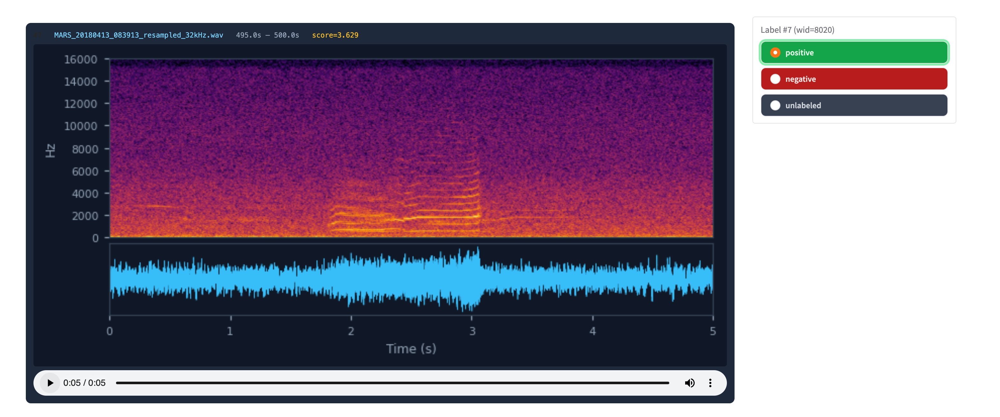
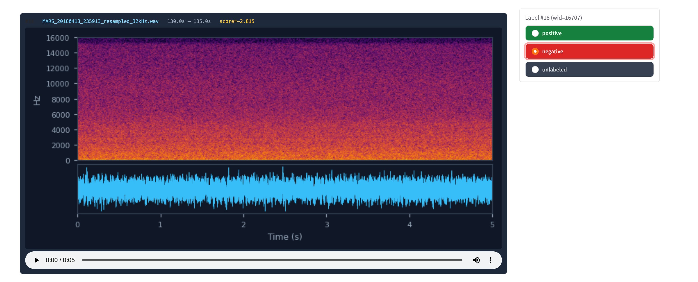
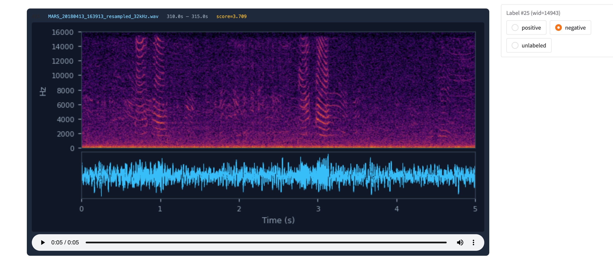
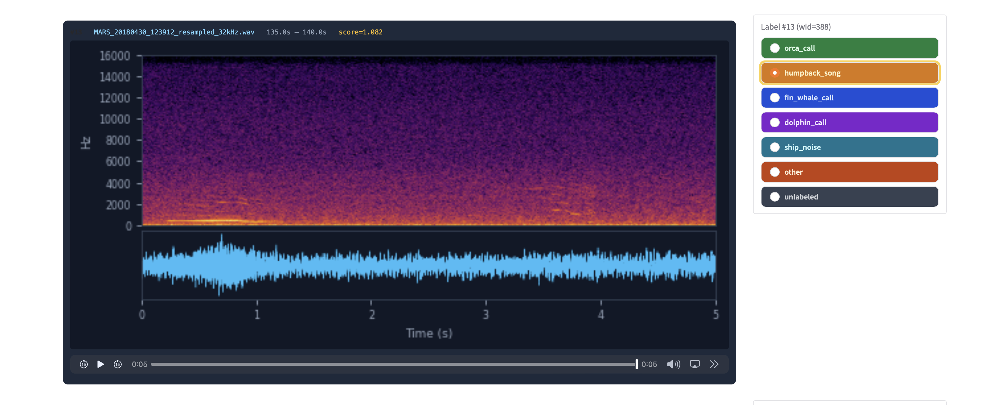
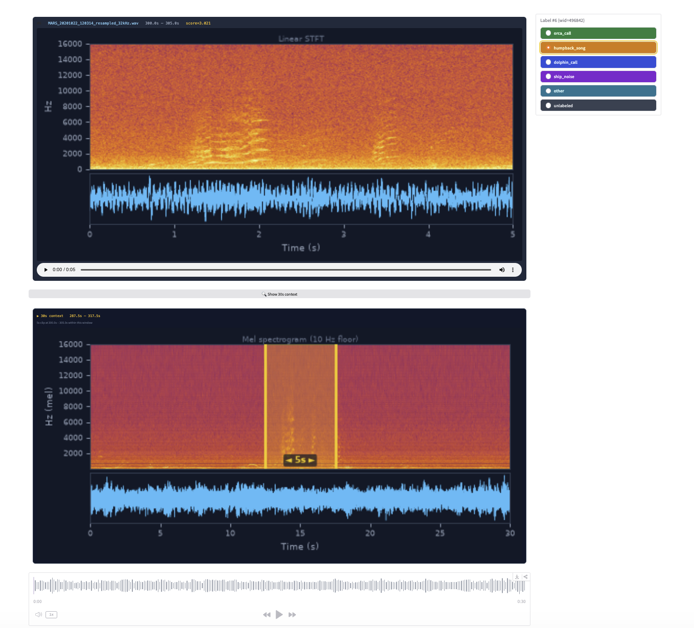
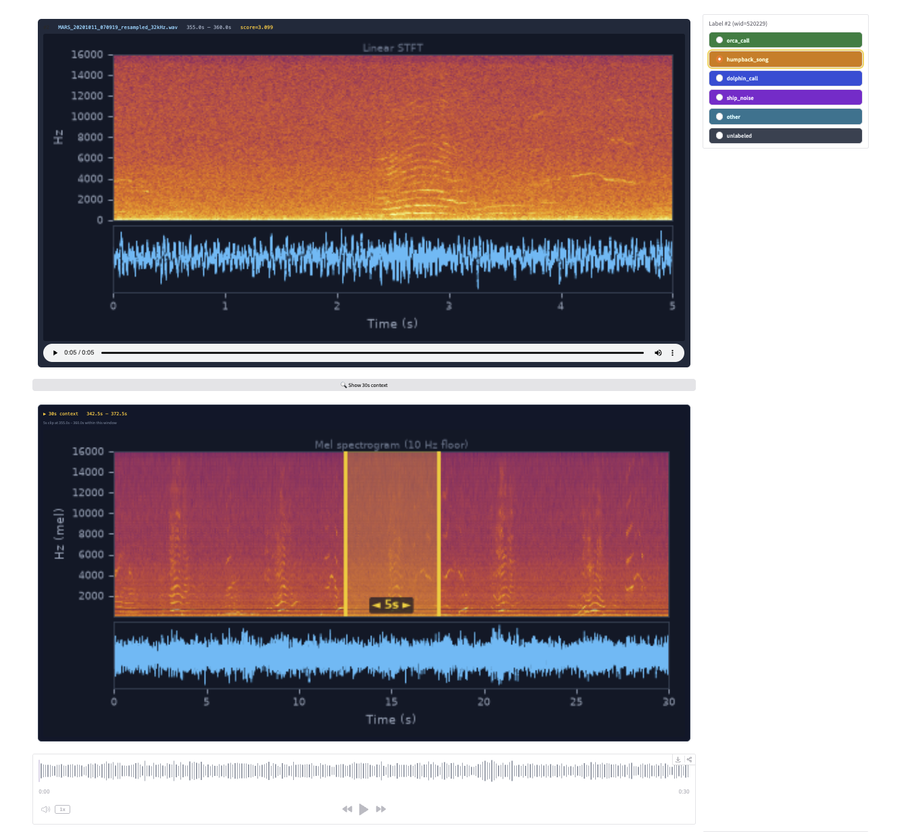

# Perch Hoplite Marine Bioacoustics Pipeline
## MBARI — NVIDIA DGX SPARC (spark-ae0e, spark-0626)

---
## Overview

Built on Google perch-hoplite
https://github.com/google-research/perch-hoplite

https://github.com/google-research/perch/blob/main/chirp/projects/whale_demo/agile_modeling_noaa_demo.ipynb

Hoplite is a system for storing large volumes of embeddings from machine
perception models. We focus on combining vector search with active learning
workflows, aka [agile modeling](https://arxiv.org/abs/2505.03071).

In brief, agile modeling is a process for rapidly developing classifiers using
embeddings from a pre-trained 'foundation' model. For bioacoustics work, we
find that new classifiers can often be developed for new signals in under
an hour.

**How does it work?**

We first use a bioacoustics model to convert the unlabeled audio data into
embeddings - these are like semantic 'fingerprints' of 5-second audio clips.
Then, you can *search* the embeddings of your data by providing an example of
what you're looking for. You then give feedback on the results - which examples
are and are not what you're looking for. From this feedback, we can quickly
train a classifier. You can then improve on the classifier with
*active learning*: Examine the classifier outputs, provide more feedback, and
re-train the classifier.

A key feature of this workflow is that we pre-compute the embeddings. This
may take a while if you have a large amount of data, but the subsequent search
and classifier training is very efficient.

https://research.google/blog/how-ai-trained-on-birds-is-surfacing-underwater-mysteries/ 

https://arxiv.org/abs/2512.03219 https://arxiv.org/abs/2508.04665 


## System Overview

| Machine | Role | IP / Access |
|---|---|---|
| **Mac workstation** | Developer workstation | Local — scp gateway to spark |
| **spark-ae0e** | Embedding, active learning, inference, Gradio server | 134.89.11.107 |
| **spark-0626** | Spare / parallel runs | 134.89.11.174 |

### Why the split?

The spark servers have NVIDIA GB10 (Blackwell, compute capability 12.1) GPUs.
**July 2026:** The pipeline runs entirely on spark-ae0e. No Google Drive, no internet required for embedding. See `clean_install.sh` for setup.

| | spark-ae0e | spark-0626 |
|---|---|---|
| IP address | 134.89.11.107 | 134.89.11.174 |
| PAM_Analysis | /mnt/PAM_Analysis (NFS4, rw) | /mnt/PAM_Analysis (NFS4, rw) |
| PAM_Archive | /mnt/PAM_Archive (NFS4, rw) | /mnt/PAM_Archive (NFS4, rw) |
| NFS server | thalassa.shore.mbari.org | thalassa.shore.mbari.org |
| Python venv | ~/perch-hoplite/venv | unified TF-free environment |
| perch-hoplite | 1.0.1 | 1.0.1 |

Both spark machines share the same NFS volumes. Databases, models, results,
and labels written on one are immediately visible on the other.

---

## Directory Structure

```
spark-ae0e / spark-0626 (NFS shared)
/mnt/PAM_Analysis/duane_scratch/perch_hoplite/
    db/                             ← Hoplite embedding databases
        MARS_20180413_20180413_32kHz/   ← April 13 2018 (144 files, 17,280 embeddings)
    models/                         ← trained classifiers (.pt + .metrics.json)
        orca_v1.pt                  ← first classifier, ROC-AUC 0.754
    results/                        ← inference CSVs, score histogram PNGs
    labels/                         ← annotation CSVs (bootstrap + active learning)
    queries/
        cetaceans/                  ← orca, dolphin, whale reference clips
        anthropogenic/              ← boat, ROV, sonar reference clips
    logs/                           ← persistent logs

/mnt/PAM_Analysis/GoogleMultiSpeciesWhaleModel2/
    resampled_32kHz/                ← source audio resampled to 32 kHz
        2018/04/                    ← MARS recordings April 2018

/mnt/PAM_Archive/                   ← RAW AUDIO (read-only, 273 TB)
    2015/ 2016/ ... 2026/
```

---

## Installation Status (spark-ae0e as of July 2026)

Already installed in venv — do not reinstall:

Activate: `source ~/perch-hoplite/venv/bin/activate`

```
torch                2.12.1+cu130
perch-hoplite        1.0.1
gradio               6.15.1
soundfile            0.13.1
librosa              0.11.0
scipy
matplotlib
scikit-learn
ml_collections
timm
```

Known harmless warnings at startup (not errors):
- `NUMA node read from SysFS had negative value` — BIOS topology quirk, harmless.
- `Failed to load class list ... duplicate entries` — cosmetic, does not affect embeddings.

---

## Programs

| File | Runs on | Purpose |
|---|---|---|
| `phase1_embed_torch.py` | **spark-ae0e** | Build Hoplite embedding DB from audio (PyTorch, no Colab) |
| `phase2_classify.py` | **spark-ae0e** | Active learning: search, label, train, review, infer |
| `phase2_classify_logmel.py` | **spark-ae0e** | same as above, with log mel spectrogram display |
| `convert_scores_to_labels.py` | **spark-ae0e** | Convert Google model score CSVs to Hoplite label CSVs |

---

## Complete Workflow

### Phase 1 — Build the Embedding Database

**New (July 2026): Native PyTorch pipeline runs entirely on spark-ae0e.**
No Colab, no Google Drive, no internet required.

```bash
source ~/perch-hoplite/venv/bin/activate

# Embed a single day
python3 phase1_embed_torch.py \\
    --audio-dir /mnt/PAM_Analysis/GoogleMultiSpeciesWhaleModel2/resampled_32kHz/2018/04 \\
    --date 20180413 \\
    --db-dir /mnt/PAM_Analysis/duane_scratch/perch_hoplite/db/MARS_20180413_torch_32kHz \\
    --device cuda --compile

# Embed a full month (~37 min for 30 days)
python3 phase1_embed_torch.py \\
    --audio-dir /mnt/PAM_Analysis/GoogleMultiSpeciesWhaleModel2/resampled_32kHz/2018/04 \\
    --db-dir /mnt/PAM_Analysis/duane_scratch/perch_hoplite/db/MARS_20180401_20180430_32kHz \\
    --device cuda --compile
```

---

### Phase 2 — Active Learning Loop (spark-ae0e)

All Phase 2 steps run on spark-ae0e. The Gradio labeling GUI is accessed
from any browser on the MBARI network.

#### Step 2 — Import bootstrap labels (optional)

If you have existing annotations from Raven Pro, PAMGuard, or the Google
species model score CSVs, import them first:

```bash
# From Google model score CSVs
python3 convert_scores_to_labels.py \
    --scores-dir /mnt/PAM_Analysis/GoogleMultiSpeciesWhaleModel2/scores_gpu/ \
    --output-csv /mnt/PAM_Analysis/duane_scratch/perch_hoplite/labels/bootstrap_orca.csv \
    --target-class orca_call \
    --threshold 0.7

# Import into DB
python3 phase2_classify.py label \
    --db-dir /mnt/PAM_Analysis/duane_scratch/perch_hoplite/db/MARS_20180413_20180413_32kHz \
    --labels-csv /mnt/PAM_Analysis/duane_scratch/perch_hoplite/labels/bootstrap_orca.csv \
    --annotator-id duane
```

#### Step 3 — Train initial classifier

```bash
python3 phase2_classify.py train \
    --db-dir /mnt/PAM_Analysis/duane_scratch/perch_hoplite/db/MARS_20180413_20180413_32kHz \
    --classifier-out /mnt/PAM_Analysis/duane_scratch/perch_hoplite/models/orca_v1.pt \
    --num-steps 256
```

Metrics are printed after training and saved to `orca_v1.metrics.json`.
Target ROC-AUC > 0.90 before running full inference.

#### Step 4 — Review and label (active learning)

Launch the Gradio labeling GUI on spark, open in any browser on the MBARI network:

```bash
# On spark-ae0e
nohup python3 phase2_classify.py review \
    --db-dir /mnt/PAM_Analysis/duane_scratch/perch_hoplite/db/MARS_20180413_20180413_32kHz \
    --classifier /mnt/PAM_Analysis/duane_scratch/perch_hoplite/models/orca_v1.pt \
    --target-label orca_call \
    --num-results 50 \
    --sample-size 5000 \
    --audio-dir /mnt/PAM_Analysis/GoogleMultiSpeciesWhaleModel2/resampled_32kHz/2018/04 \
    --serve --port 7860 \
    > /mnt/PAM_Analysis/duane_scratch/perch_hoplite/logs/review_7860.log 2>&1 &
```

**`--audio-dir` is required** — this flag sets the audio path for the Gradio GUI.

Open in browser: **http://134.89.11.107:7860**

The GUI shows the top-50 highest-scoring candidates with:
- Spectrogram (0–16 kHz, log-power, inferno colormap)
- Waveform
- Custom audio player with high-contrast progress bar
- Multi-class colored radio buttons (up to 6 named classes + unlabeled)

Audio is automatically normalized to −3 dBFS for comfortable listening
(the resampled MARS files have very low amplitude at native levels).

**Labeling strategy (multi-class):**

Each clip is assigned to exactly one class. There is no generic "negative" —
instead every sound type gets its own label, making the classifier richer:

- `orca_call` 🟢 — orca call clearly present: banded harmonics 1–6 kHz
- `humpback_song` 🟡 — humpback song units: complex harmonics 100 Hz–4 kHz
- `dolphin_call` 🟣 — Pacific white-sided dolphin burst pulses: dense vertical striping 2–14 kHz
- `ship_noise` 🩵 — vessel engine: regular low-frequency pulsing
- `other` 🟠 — any clearly structured sound that doesn't fit the above (ROV, unknown bio)
- `unlabeled` ⬛ — genuinely ambiguous or too faint to identify — skip, do not save

**Decision guidelines:**
- If you can see or hear clear call structure leaning toward one class (≥60% confident) → label it
- If the UTC timestamp is in a known active window for a species → use that as a prior
- If truly 50/50 between two classes → use `unlabeled`
- Trust the spectrogram over your ears for faint calls
- `other` is for sounds with clear structure that don't match any named class
- Never use `other` for background/silence — those should be `unlabeled` or simply not reviewed

Pass the class list at launch time with `--classes`:
```bash
--classes orca_call,humpback_song,dolphin_call,ship_noise,other,unlabeled
```

Click **💾 Save Labels to DB** when done. The status box confirms save counts per class.

To monitor the server:
```bash
tail -f /mnt/PAM_Analysis/duane_scratch/perch_hoplite/logs/review_7860.log
```

To stop the server:
```bash
pkill -f "phase2_classify.py review"
```

#### Step 5 — Retrain with new labels

⚠️ **Always kill the Gradio review server before training.** The review server
holds several GB of GPU memory. Training will fail with `cudaSetDevice() out of memory`
if both run simultaneously.

```bash
pkill -f "phase2_classify.py review"
```

```bash
nohup python3 phase2_classify.py train \
    --db-dir /mnt/PAM_Analysis/duane_scratch/perch_hoplite/db/MARS_20180413_20180413_32kHz \
    --classifier-out /mnt/PAM_Analysis/duane_scratch/perch_hoplite/models/orca_v2.pt \
    --num-steps 256 \
    > /mnt/PAM_Analysis/duane_scratch/perch_hoplite/logs/train_orca_v2.log 2>&1 &
tail -f /mnt/PAM_Analysis/duane_scratch/perch_hoplite/logs/train_orca_v2.log
```

```bash
nohup python3 phase2_classify.py train \
    --db-dir /mnt/PAM_Analysis/duane_scratch/perch_hoplite/db/MARS_20180413_20180413_32kHz \
    --classifier-out /mnt/PAM_Analysis/duane_scratch/perch_hoplite/models/orca_v3_clean.pt \
    --num-steps 256 \
    --train-ratio 0.8 \
    > /mnt/PAM_Analysis/duane_scratch/perch_hoplite/logs/train_orca_v3_clean.log 2>&1 &
sleep 5 && tail -f /mnt/PAM_Analysis/duane_scratch/perch_hoplite/logs/train_orca_v3_clean.log
```


Repeat Steps 4–5 until ROC-AUC is satisfactory. Increment the version number
(`orca_v2.pt`, `orca_v3.pt`, ...) to preserve each iteration.

For margin sampling (finding hard negatives near the decision boundary):
```bash
nohup python3 phase2_classify.py review \
    --db-dir /mnt/PAM_Analysis/duane_scratch/perch_hoplite/db/MARS_20180413_20180413_32kHz \
    --classifier /mnt/PAM_Analysis/duane_scratch/perch_hoplite/models/orca_v2.pt \
    --target-label orca_call \
    --num-results 50 \
    --sample-size 17280 \
    --margin-target-score 0.0 \
    --audio-dir /mnt/PAM_Analysis/GoogleMultiSpeciesWhaleModel2/resampled_32kHz/2018/04 \
    --serve --port 7860 \
    > /mnt/PAM_Analysis/duane_scratch/perch_hoplite/logs/review_7860.log 2>&1 &
```

#### Step 6 — Check label counts at any time

```bash
python3 phase2_classify.py stats \
    --db-dir /mnt/PAM_Analysis/duane_scratch/perch_hoplite/db/MARS_20180413_20180413_32kHz
```

#### Step 7 — Full inference → detections CSV

```bash
python3 phase2_classify.py infer \
    --db-dir /mnt/PAM_Analysis/duane_scratch/perch_hoplite/db/MARS_20180413_20180413_32kHz \
    --classifier /mnt/PAM_Analysis/duane_scratch/perch_hoplite/models/orca_v2.pt \
    --output-csv /mnt/PAM_Analysis/duane_scratch/perch_hoplite/results/MARS_20180413_orca_detections.csv \
    --logit-threshold 0.0 \
    --plot-distribution /mnt/PAM_Analysis/duane_scratch/perch_hoplite/results/MARS_20180413_orca_logit_dist.png
```

### Step 8 - Review detections produced by perch-hoplite system

```bash
nohup python3 phase2_classify.py review     --db-dir /mnt/PAM_Analysis/duane_scratch/perch_hoplite/db/MARS_20180413_20180413_32kHz     --classifier /mnt/PAM_Analysis/duane_scratch/perch_hoplite/models/orca_v1_clean.pt     --target-label orca_call     --detections-csv /mnt/PAM_Analysis/duane_scratch/perch_hoplite/results/MARS_20180413_orca_v1_clean_detections.csv     --num-results 25     --detections-offset 1     --classes orca_call,dolphin_call,other,unlabeled     --audio-dir /mnt/PAM_Analysis/GoogleMultiSpeciesWhaleModel2/resampled_32kHz/2018/04     --serve --port 7860     > /mnt/PAM_Analysis/duane_scratch/perch_hoplite/logs/review_7860.log 2>&1 &
```

### optional Step 8 -- Review detections, logmel spectrogram display, optional --grayscale spectrogram display

```bash
nohup python3 phase2_classify_logmel.py review     --db-dir /mnt/PAM_Analysis/duane_scratch/perch_hoplite/db/MARS_20180413_20180413_32kHz     --classifier /mnt/PAM_Analysis/duane_scratch/perch_hoplite/models/orca_v1_clean.pt     --target-label orca_call     --detections-csv /mnt/PAM_Analysis/duane_scratch/perch_hoplite/results/MARS_20180413_orca_v1_clean_detections.csv     --num-results 25     --detections-offset 200     --classes orca_call,dolphin_call,other,unlabeled     --audio-dir /mnt/PAM_Analysis/GoogleMultiSpeciesWhaleModel2/resampled_32kHz/2018/04  --grayscale  --serve --port 7860     > /mnt/PAM_Analysis/duane_scratch/perch_hoplite/logs/review_7860.log 2>&1 &
```

--detections-offset is updated manually from 0 to n to select which annotations to review

0 (1 to --num-results here 25)

25 (26 to 50)

...

200 (201 to 225)

...

---

## Current Status (as of July 5 2026)

| Item | Status |
|---|---|
| DB: MARS April 13 2018 | ✅ 17,280 embeddings — primary training DB |
| DB: MARS April 1 2018 | ✅ 17,280 embeddings |
| DB: MARS April 20 2018 | ✅ 17,280 embeddings |
| DB: MARS April 30 2018 | ✅ 17,280 embeddings |
| DB: MARS May 2 2018 | ✅ 17,280 embeddings |
| DB: MARS April 2018 (full month) | ✅ **518,400 embeddings** — all 30 days, 37 min on GB10 |
| PyTorch embedding pipeline | ✅ `phase1_embed_torch.py` — no Colab, 231 windows/sec |
| orca_v1_clean.pt | ✅ ROC-AUC 0.982 — 100 labels, single-class |
| orca_v2_clean.pt | ✅ ROC-AUC 0.919 — 110 labels, single-class |
| orca_v3_clean.pt | ✅ ROC-AUC 0.990 — multi-class: orca + dolphin |
| orca_v4_clean.pt | ✅ ROC-AUC 0.974 — multi-class: orca + dolphin + other |
| **Normalization fix (July 2026)** | ✅ per-window peak-norm to 0.25 — cos 1.0 vs live TF on MARS audio |
| orca_v0.pt | ✅ **ROC-AUC 0.9773** — April 2018 normalized, 5 classes, 22 sec |
| orca_v1.pt | ✅ **ROC-AUC 0.9533** — April + October 2020 normalized, 5 classes |
| Inference April 2018 v1 | ✅ **286 orca Apr 13** + 15,611 dolphin + 1,267 humpback + 1,741 ship |
| Inference October 2020 v1 | ✅ **204 orca** (Oct 5-12 cluster) + 223,214 humpback + 3,344 dolphin |
| TF-free pipeline | ✅ zero TF imports — single venv `~/perch-hoplite/venv` |
| Expert annotation | ✅ 41 humpback (April, J. Ryan) + 209 humpback + 5 dolphin (October) |
| DB: MARS April 2018 normalized | ✅ 518,400 embeddings — 30 days, 37 min on GB10 |
| DB: MARS October 2020 normalized | ✅ 535,278 embeddings — 31 days, 40 min on GB10 |
| DB: MARS May 2018 normalized | ✅ 535,680 embeddings — 31 days, 38 min on GB10 |
| October 2020 orca event Oct 5-12 | ✅ confirmed cluster — CA140B, CA51A pods documented |

### Orca event timing on April 13 2018 (UTC)

From annotation analysis, orca calls were detected during:
- **00:19–00:29 UTC** — brief overnight activity
- **06:49–09:49 UTC** — morning feeding event
- **12:59 UTC** — midday
- **14:19–18:29 UTC** — main afternoon feeding event (densest)
- **20:49 UTC** — late activity

In **Pacific Daylight Time (UTC−7):** main event was 07:19–11:29 local —
consistent with morning gray whale calf migration through the bay.

**Best windows for NEGATIVE labels (quiet hours on April 13 UTC):**
- 03:00–06:00 UTC (20:00–23:00 PDT previous day)
- 10:00–12:00 UTC (03:00–05:00 PDT)
- 21:00–23:59 UTC (14:00–16:59 PDT)

### Key Lessons from Development Phase

1. **Dolphin false positives** — Perch V2 embeddings place Pacific white-sided
   dolphin pulsed calls near orca calls (Henderson et al. 2011, JASA). High
   classifier scores do NOT always mean orca. Always listen and check the
   spectrogram. Use label `dolphin_call` (not `dolphin_whistle`) since it is
   the pulsed calls — not tonal whistles — that cause confusion with orca.
   **Resolved in v1** by adding dolphin_call as a separate class.

2. **Cross-day DB merging degrades performance** — merging embeddings from
   different days hurt ROC-AUC. Stay within one deployment day for training.
   The 17,280 windows on April 13 contain natural `orca_call` weak-negatives in the quiet hours.

3. **Kill Gradio before training** — review server holds GPU memory; training
   will fail with OOM if both run simultaneously.

4. **Eval set size matters** — with train_ratio=0.9 and ~550 labels, only
   ~55 eval examples → high ROC-AUC variance. Use --train-ratio 0.8 for
   reliable metrics.

5. **Label deliberately** — target positives from known active UTC hours,
   negatives from known quiet UTC hours. Random sampling wastes labeling effort.

6. **Humpback false positives** — on April 30 2018, 26 orca detections were
   reviewed and found to be 11 humpback_song, 8 ship_noise, 6 dolphin_call,
   1 other — zero real orca. The v4_clean classifier has no humpback or
   ship_noise training examples so it assigns these to orca by default.
   Next step: add humpback_song and ship_noise labels and retrain v5_clean.

7. **DB model_config** — DBs created by `phase1_embed_torch.py` are clean.
   Legacy DBs from older tools may need the model_config patch (see below).

8. **Pure PyTorch pipeline** — `phase1_embed_torch.py` runs on spark-ae0e
   at 231 windows/sec (37 min for a full month). Training is 16 seconds
   (pre-loads embeddings to GPU). Zero TF dependencies. Single venv at
   `~/perch-hoplite/venv`. See `clean_install.sh` to set up.

### Post-Download Patch — Legacy DBs only

DBs created by `phase1_embed_torch.py` do not need this patch.
Legacy DBs from older tools may contain `logit_slope` and `logit_intercept`
fields in the stored model config which cause errors. Fix by running:

```bash
sqlite3 /mnt/PAM_Analysis/duane_scratch/perch_hoplite/db/<DATASET_NAME>/hoplite.sqlite \
    "UPDATE hoplite_metadata SET value='{\"model_key\": \"taxonomy_model_tf\", \"embedding_dim\": 1536, \"model_config\": {\"window_size_s\": 5.0, \"hop_size_s\": 5.0, \"sample_rate\": 32000, \"tfhub_path\": \"google/bird-vocalization-classifier/tensorFlow2/perch_v2\", \"tfhub_version\": 2, \"model_path\": \"\"}, \"logits_key\": null, \"logits_idxes\": null}' WHERE key='model_config';"
```

Verify with:
```bash
sqlite3 /path/to/db/hoplite.sqlite "SELECT value FROM hoplite_metadata WHERE key='model_config';"
```

The output should show no `logit_slope` or `logit_intercept` fields.

### Clean labeling strategy (current)

- **Positive labels:** target files from UTC 06:49–20:49 (orca active hours)
- **Negative labels:** target files from UTC 21:00–06:00 (quiet hours)
- **Multi-class:** use `--classes orca_call,dolphin_call,other,unlabeled` when
  reviewing inference detections to separate species in one pass
- **Train ratio:** 0.8 for reliable eval signal
- **Target ROC-AUC:** > 0.90 before full inference ✅ achieved (v3_clean: 0.990)

**Guidelines**
Use **unlabeled** (skip it) when:

- You genuinely cannot tell what it is after listening and looking at the spectrogram
- The signal is so faint you can't make out any structure
- You're uncertain between two classes and don't want to bias the classifier

Use **other** when:

- You can clearly hear something but it's definitely not orca or dolphin — e.g. a boat, a loud transient, flow noise artifact, or an unknown biological sound
- The spectrogram shows clear structure but it doesn't match either target class

Give your best guess (**orca_call** or **dolphin_call**) when:

You can see or hear partial call structure that looks like one class more than the other, even if faint
The UTC timestamp is in the known orca active window (14:19–18:29 UTC) — a faint signal in that window is more likely orca than not
You're 60%+ confident — a soft label is still better than no label for a classifier

The key principle: unlabeled is the right choice when you're truly 50/50. But if you're leaning even slightly toward one class, label it — the classifier can handle a few soft labels. What hurts the classifier most is confidently wrong labels (labeling a dolphin as orca), not uncertain-but-correct labels.
For faint signals specifically: if you see the characteristic banded harmonic structure of orca in the spectrogram even if quiet, trust the spectrogram over the audio and label it orca_call. The spectrogram is often more informative than your ears for faint calls.

### Inference results summary

#### April 13 2018 — confirmed Bigg's orca event

| Model | ROC-AUC | Orca | Dolphin | Humpback | Ship | Other | Notes |
|---|---|---|---|---|---|---|---|
| v1_clean | 0.982 | 227 | — | — | — | — | Single class |
| v2_clean | 0.919 | 239 | — | — | — | — | Single class |
| v3_clean | 0.990 | 321 | 205 | — | — | — | Multi-class |
| v4_clean | 0.974 | 295 | 2,253 | — | — | 159 | Multi-class |
| v5_clean | 0.973 | 295 | 2,177 | — | — | 161 | Pure PyTorch |
| v6_clean | 0.972 | 295 | 2,177 | — | — | 161 | + humpback/ship |

#### Full April 2018 — v6_clean

| Class | Detections | Days active | Notes |
|---|---|---|---|
| orca_call | 1,607 | 21 | April 13 dominant event (295); others likely FP |
| dolphin_call | 14,883 | 30 | Resident throughout month |
| humpback_song | 735 | 24 | April 19 spike (250) — expert review pending |
| ship_noise | 1,899 | 21 | Episodic vessel passages |
| other | 3,385 | 21 | Unclassified |

#### Full October 2020 — v6_clean (COVID-quiet vessel traffic)

| Class | Detections | Days active | Notes |
|---|---|---|---|
| humpback_song | 66,495 | 31 | Dominant species — peak fall season |
| orca_call | 41,294 | 31 | Oct 5-12 cluster confirmed — CA140B, CA51A pods |
| dolphin_call | 13,569 | 31 | Consistent daily presence |
| ship_noise | 142 | 6 | Dramatically reduced — COVID lockdown |
| other | 201 | 4 | Minimal unclassified |

October 2020 orca detections cluster strongly October 5–12, matching
independent whale watch reports of CA140B (matriarch "Louise") and CA51A pods.
This cross-validated detection — trained on April 2018, tested on October 2020
— demonstrates the classifier generalizes across seasons.
*Source: California Killer Whale Project, https://www.californiakillerwhaleproject.org/orcas*

---

## Multi-class Classification

Run review/label once per sound class with a distinct `--target-label`.
All labels accumulate in the same DB. Train once — the classifier is
automatically multi-class.

Suggested label names:
```
orca_call           # Bigg's / resident orca vocalizations
humpback_song       # humpback whale song units
dolphin_call        # Pacific white-sided dolphin burst pulse calls
ship_noise          # vessel engine noise (regular low-freq pulsing)
other               # catch-all: ROV thruster, unknown bio, unclassified
unlabeled           # skip — always last, always gray
```

For multi-class Gradio review sessions, pass `--classes` with comma-separated
labels in the order you want them displayed. Up to 6 named classes supported
(plus unlabeled = 7 buttons total). Button colors by position:

| Position | Color | Suggested use |
|---|---|---|
| 1 | Green | orca_call |
| 2 | Amber | humpback_song |
| 4 | Purple | dolphin_call |
| 5 | Teal | ship_noise |
| 6 | Orange | other |
| last | Gray | unlabeled |

Example for May 2 2018 review session:
```bash
--classes orca_call,humpback_song,dolphin_call,ship_noise,other,unlabeled
```

### Species acoustic signatures for MARS hydrophone

Understanding where each species' energy falls in the spectrogram is
critical for correct labeling, especially since the Gradio spectrogram
displays 0–16 kHz. Note that blue whale and fin whale calls are
**infrasonic** — their fundamental energy is below the 0 Hz axis of
the display. They appear as very low-frequency energy near the bottom
of the spectrogram, and only their harmonics may be visible.

#### Orca (Killer Whale) — `orca_call`
- **Frequency range:** 0.5–25 kHz, most energy 1–6 kHz
- **Call types:** discrete pulsed calls, whistles, echolocation clicks
- **Spectrogram signature:** structured banded harmonic bursts, 1–6 kHz,
  clearly distinct from background. Duration 0.5–2 seconds per call.
- **Monterey Bay seasonality:** peak mid-March through mid-May (Bigg's orca
  hunting gray whale calves). Other ecotypes present year-round.

#### Pacific White-Sided Dolphin — `dolphin_call`
- **Whistles:** 3–14 kHz, upsweeping/downsweeping tonal arcs
- **Clicks:** broadband, >10 kHz
- **Calls:** 
- **Important:** Perch V2 embeddings place dolphin and orca calls near
  each other — dolphin calls are the most common **false positive**
  for the orca classifier. Score alone cannot distinguish them; always
  check the spectrogram.

#### Blue Whale — `blue_whale_call`
- **Frequency range:** 10–40 Hz (infrasonic — below display range)
- **Peak energy:** "B call" harmonics centered at 15–16 Hz and 30–43 Hz
- **Intensity:** up to 189 dB re 1 μPa — among the loudest animal sounds
- **Propagation:** hundreds to thousands of miles across ocean basins
- **Spectrogram signature:** very low-frequency energy at bottom of display,
  may appear as bright band near 0 Hz. Harmonics occasionally visible up
  to ~80 Hz.
- **References:** [Thompson et al. 2017](https://www.nature.com/articles/s41598-017-09423-7),
  [DOSITS](https://dosits.org/galleries/audio-gallery/marine-mammals/baleen-whales/blue-whale/)

#### Humpback Whale — `humpback_song`
- **Frequency range:** 20 Hz–10 kHz, most energy 100 Hz–4 kHz
- **Spectrogram signature:** complex song units with rich harmonic structure,
  visible across a wide frequency range. Clearly audible and visually
  distinctive.

#### Gray Whale — `gray_whale_call`
- **Frequency range:** 40 Hz–1.6 kHz, peak energy below 100 Hz
- **Call types:**
  - **M3 migratory moan** — most common during migration; dominant energy
    20–200 Hz, narrow bandwidth, low-frequency moan
  - **S1/M1 knocks** — bongo- or metallic-drum-like broadband pulses;
    peak energy 100 Hz–1.6 kHz
- **Spectrogram signature:** M3 moans appear as faint low-frequency energy
  near the bottom of the display. S1/M1 knocks may be visible up to ~1.6 kHz
  as broadband transient bursts.
- **Ecological note:** Gray whale calves migrate northward through Monterey
  Bay mid-March through mid-May — the same window as peak Bigg's orca activity.
  Orca prey on these calves. Gray whale vocalizations and orca attack calls
  may co-occur in the same recordings.
- **References:** [DOSITS](https://dosits.org/galleries/audio-gallery/marine-mammals/baleen-whales/gray-whale/),
  [Tyack & Clark 2000](https://pdfs.semanticscholar.org/bc3c/b56a934cc176b7afc3847257e8730df06747.pdf)

#### Note on infrasonic species at 32 kHz sample rate
The MARS files are resampled to 32 kHz, giving a Nyquist of 16 kHz.
Blue whale and fin whale fundamentals (10–40 Hz) are below the reliable detection range of this system —
range and fully captured. However, the Gradio spectrogram uses a linear
frequency axis — the bottom ~2% of the display covers 0–320 Hz where
all baleen whale energy concentrates. Consider using a log-frequency
spectrogram for baleen whale work. Use logmel spectrogram display, optional --grayscale spectrogram display.

---

## Spectrogram Examples — What to Look For

These examples show the three main patterns you will encounter in the
Gradio labeling interface. The spectrogram shows frequency (Hz) on the
Y axis and time (0–5 seconds) on the X axis. Color intensity indicates
sound energy (bright = loud).

### Orca call — label orca_call
**Score: 3.629 | File: MARS_20180413_083913 | 495–500s**



Characteristic orca call signature: discrete bright energy bursts with
harmonic stacking visible between 1–6 kHz, appearing as horizontal
banded structures. The call is clearly structured and distinct from
background noise. The waveform shows clear amplitude peaks corresponding
to the calls. UTC 08:39 = PDT 01:39 — overnight orca feeding activity.

---

### Ocean background — label `other`
**Score: −2.815 | File: MARS_20180413_235913 | 130–135s**



Featureless broadband noise across all frequencies. Energy is uniformly
distributed with no structured features. This is typical deep-water
ambient noise — flow noise, distant shipping, and biological background.
The waveform is stationary with no transients. UTC 23:59 = PDT 16:59 —
mid-afternoon, well outside the orca event window. Label as `other` — featureless background with no biological signal.

---

### Dolphin call — label `dolphin_call`
**Score: 3.709 | File: MARS_20180413_163913 | 310–315s**



High-frequency tonal whistles with distinctive upsweeping and downsweeping
frequency modulation, extending from ~3 kHz up to 14+ kHz. These are
Pacific white-sided dolphin calls — entirely different structure from
orca calls. Score is high (3.709) because the Perch V2 embedding places
dolphin and orca calls near each other in embedding space. This is a
classic **false positive** for orca — label `dolphin_call` as its own positive class.
The multi-class classifier handles this correctly by learning dolphin as a separate category.

---

### Dolphin burst pulse call — label DOLPHIN_CALL (multi-class classifier)
**Score: 0.020 | File: MARS_20180413_172913 | 380–385s**


Dense vertical striping across 2–14 kHz — the characteristic signature of
Pacific white-sided dolphin burst pulse calls (Henderson et al. 2011, JASA).
Unlike the tonal upsweeping whistles in the previous example, burst pulses
appear as rapid broadband click trains producing continuous vertical streaks
across a wide frequency range. The score is very low (0.020) — the v3_clean
multi-class classifier correctly assigns this to `dolphin_call` rather than
`orca_call`. UTC 17:29 = PDT 10:29 — within the known afternoon dolphin
activity window. In the multi-class Gradio interface, label these as
`dolphin_call` (amber button).

---

### Humpback song — label HUMPBACK_SONG
**Score: 1.082 | File: MARS_20180430_123912 | 135–140s**



Faint low-frequency energy near the bottom of the spectrogram — consistent
with humpback whale song units whose dominant energy is in the 100 Hz–4 kHz
range. The score is moderate (1.082) — the v4_clean orca classifier has no
humpback training examples, so these score above threshold as false positives.
UTC 12:39 PDT 05:39 — early morning, April 30 2018. Expert confirmation
pending. In the multi-class Gradio interface, label these as `humpback_song`
(amber button). Note: Safari renders the audio controls better than Chrome
for listening to these low-frequency calls.

---

## Gradio Labeling GUI — Details

The GUI runs on spark and is accessed from any browser on the MBARI network.
It does not require any software installation on the client machine.

Per-clip display:
- **Header**: filename, time offset, classifier score
- **Spectrogram**: 0–16 kHz, 60 dB dynamic range, inferno colormap
- **Waveform**: full 5-second window
- **Player**: HTML5 audio player
- **30-second context**: pre-computed mel spectrogram with yellow fiducial markers
  showing the 5-second clip location within the broader acoustic context
- **Radio**: label class buttons (color-coded per class)

Labels auto-save on every click and on **💾 Save Labels to DB**.
Only one analyst should label a given DB at a time to avoid SQLite write conflicts.

### 30-Second Context Feature

Each clip displays a 30-second mel spectrogram context window centered on the
5-second clip, with yellow markers showing exactly where the clip falls. This
is pre-computed at Gradio startup — no waiting.



*Orca candidate (April 13 2018): 5-second linear STFT (top), 30-second mel context
with yellow fiducial markers (bottom), and 30-second audio player. The context window
reveals the broader acoustic environment — quiet background confirming this is a clean
isolated orca call, not embedded in noise.*



*Humpback song candidate (October 2020): the 30-second mel context reveals the
repeating low-frequency phrase structure diagnostic of humpback song — entirely
invisible in the 5-second clip alone. Yellow markers locate the 5-second window
within the broader context. This is why the 30-second context is essential for
distinguishing humpback song from other low-frequency sounds.*

### Spectrogram Modes

The `--spectrogram-type` flag controls the 5-second clip display:

| Mode | Best for | Description |
|---|---|---|
| `linear` | Orca, dolphin | Linear-frequency STFT, 0–16 kHz (default) |
| `mel` | Humpback | Mel-scale log power, 10 Hz floor |
| `perch` | Model inspection | Exact Perch 2.0 frontend — what the model sees |
| `pcen` | Quiet signals | PCEN mel — makes low-amplitude calls pop |

For concurrent multi-analyst campaigns, use Label Studio:
```bash
docker run -d -p 8080:8080 \
    -v /mnt/PAM_Analysis/duane_scratch/perch_hoplite/labelstudio:/label-studio/data \
    heartexlabs/label-studio:latest
```
Access at http://134.89.11.107:8080

---

## Provenance and Reproducibility

Every labeling session and training run writes a JSON audit record so that
any classifier can be fully reproduced from scratch given the original audio.

### Directory structure

```
/mnt/PAM_Analysis/duane_scratch/perch_hoplite/provenance/
    labels/
        labels_20260604_132500_analyst.json   ← one file per labeling session
        labels_20260605_110000_analyst.json
    training/
        train_20260604_150000_orca_v1.json    ← one file per training run
        train_20260605_125234_orca_v5.json
```

### Labeling session record

Written automatically when **💾 Save Labels to DB** is clicked.

```json
{
  "session_id":        "20260605_132500_analyst",
  "timestamp":         "2026-06-05T13:25:00",
  "db_dir":            "/mnt/.../MARS_20180413_20180413_32kHz",
  "classifier":        "/mnt/.../models/orca_v4.pt",
  "annotator_id":      "analyst",
  "query_label":       "orca_call",
  "annotation_count":  50,
  "positive_count":    6,
  "negative_count":    44,
  "annotations": [
    {
      "window_id": 2398,
      "filename":  "MARS_20180413_143913_resampled_32kHz.wav",
      "offset_s":  95.0,
      "end_s":     100.0,
      "label":     "orca_call",
      "label_type": 2,   // label_type=2 = weak negative (confirmed NOT this class)
      "score":     3.241
    }
  ]
}
```

### Training run record

Written automatically after each `train` command completes.

```json
{
  "session_id":    "20260605_135000_orca_v5",
  "timestamp":     "2026-06-05T13:50:15",
  "db_dir":        "/mnt/.../MARS_20180413_20180413_32kHz",
  "classifier_out": "/mnt/.../models/orca_v5.pt",
  "elapsed_s":     530.1,
  "eval_scores":   {"roc_auc": 0.787, "top1_acc": 1.0, "cmap": 0.703},
  "annotation_counts": {"orca_call_type1": 782, "orca_call_type2": 83},
  "train_args":    {"num_steps": 256, "learning_rate": 0.001, ...}
}
```

### Reproducing a classifier from scratch

Given a provenance record and the original audio:

1. Re-embed the audio with `phase1_embed.py` using the same `--model` and `--shard-len`
2. Import the annotations using the window filenames and offsets from the label records:
   ```bash
   python3 phase2_classify.py label        --db-dir <new_db>        --labels-csv <reconstructed_from_provenance.csv>        --annotator-id duane
   ```
3. Train with the same parameters from the training record

## Utilities

| File | Purpose |
|---|---|
| `merge_annotations.py` | Copy annotations between DBs (annotations only — use with care) |
| `merge_dbs.py` | Full DB merge: SQLite + USearch index (correct way to combine DBs) |

## Model Selection Guide

| Model | Best for | Notes |
|---|---|---|
| `perch_v2` | Broadest coverage, **recommended** | **Native PyTorch port — runs on any CUDA GPU** |
| `multispecies_whale` | Baleen whale calls, biotwangs | Pre-trained on cetaceans |
| `humpback` | Humpback song specifically | Narrow but accurate |
| `surfperch` | Coral reef soundscapes | Not suitable for deep-water MBARI sites |
| `perch_8` | Bird sounds only | Not useful for marine work |

**July 2026 update:** `perch_v2` previously required a TensorFlow-compatible A100/V100
GPU and Google Colab for embedding. The native PyTorch reimplementation
(`phase1_embed_torch.py`) now runs on any CUDA-capable GPU, including the NVIDIA
GB10 (sm_121) on spark-ae0e, at 231 windows/sec — no TensorFlow, no Colab required.

Each model requires its own separate DB — embeddings from different models
cannot be mixed in a single database.

---

## Disk Usage

```bash
df -h /mnt/PAM_Analysis /mnt/PAM_Archive
du -sh /mnt/PAM_Analysis/duane_scratch/perch_hoplite/db/* 2>/dev/null | sort -h
```

**As of July 5 2026 — total DB usage: 3.8 GB**

| DB | Embeddings | Date |
|---|---|---|
| MARS_20180401_20180401_32kHz | 17,280 | Apr 1 2018 |
| MARS_20180401_20180430_32kHz | 518,400 | Full April 2018 (primary) |
| MARS_20180413_20180413_32kHz | 17,280 | Apr 13 2018 (training DB) |
| MARS_20180413_torch_32kHz | 17,280 | Apr 13 2018 (PyTorch validation) |
| MARS_20180413_torch_compile_32kHz | 17,280 | Apr 13 2018 (compile test) |
| MARS_20180420_20180420_32kHz | 17,280 | Apr 20 2018 |
| MARS_20180430_20180430_32kHz | 17,280 | Apr 30 2018 |
| MARS_20180502_20180502_32kHz | 17,280 | May 2 2018 |
| MARS_20201001_20201031_32kHz | 535,278 | Full October 2020 (primary) |
| MARS_combined | — | Legacy — can be removed |

Rough estimate: ~9 MB per hour of audio at Perch V2 defaults (5-second windows, 1536-dim float16).
Monitor before large embedding runs: `df -h /mnt/PAM_Analysis`
