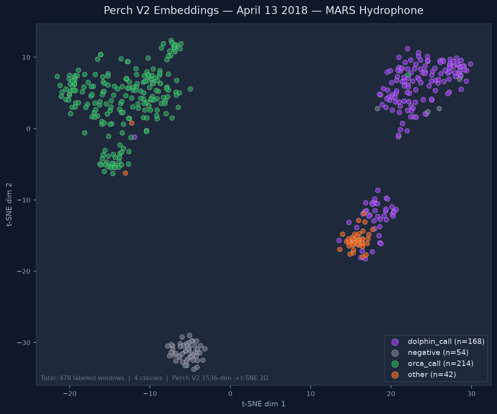
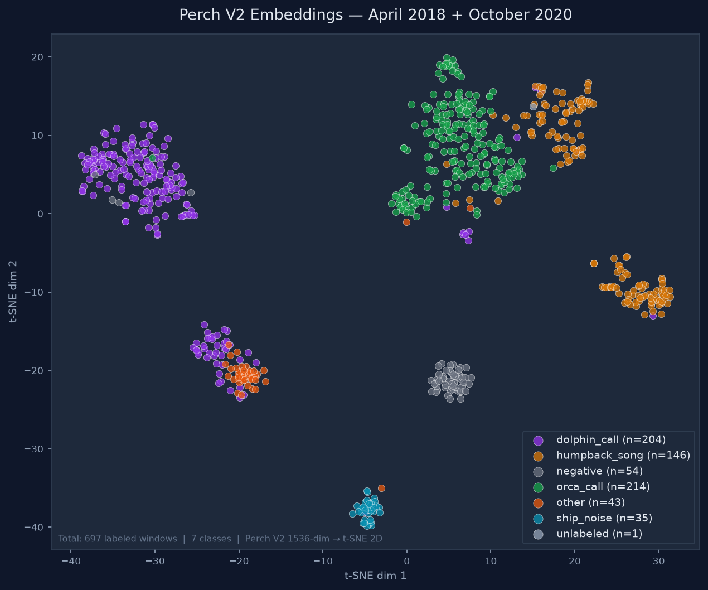

# Porting Perch 2.0 and perch-hoplite to Pure PyTorch
## Technical Summary for PyTorch Conference 2026

**Author:** Duane R. Edgington — MBARI (Monterey Bay Aquarium Research Institute)

---

## Motivation

Perch 2.0 is Google Research's state-of-the-art bioacoustics embedding model,
producing 1536-dimensional embeddings from 5-second audio clips. It was
pretrained on 14,597 species (birds, mammals, amphibians, insects) with
almost no marine mammal audio in the training set. The
perch-hoplite framework wraps Perch 2.0 with an agile active-learning pipeline
for rapid species detection from passive acoustic monitoring (PAM) data.

Both ship as TensorFlow. On the NVIDIA GB10 DGX Spark (aarch64, CUDA 13,
compute capability sm_121), prebuilt TensorFlow is effectively unavailable —
making the entire pipeline inaccessible on the newest-generation MBARI hardware.
This work removes that barrier completely.

---

## What We Ported

### 1. Perch 2.0 Embedding Model — Full Reverse Engineering

The Perch 2.0 model architecture is not fully documented. We recovered it by
inspecting the ONNX export (`justinchuby/Perch-onnx`) and cross-checking
against the `google-research/perch` source:

**Key findings (not in any documentation):**

- **Frontend is log-mel, NOT PCEN.** Perch 1.0/SurfPerch use PCEN; Perch 2.0
  uses `0.1·log(max(mel, 1e-5))`. Getting this wrong produces completely
  different embeddings.

- **Stem uses VALID padding** (→ 249×63 feature map), while all other k>1
  convolutions use JAX SAME padding. Getting this wrong drops embedding cosine
  similarity to ~0.82.

- **Mel filterbank:** 128 bands, 60 Hz–16 kHz, HTK scale, DC bin zeroed.

- **Backbone:** EfficientNet-B3, 26 MBConv blocks with folded BatchNorm,
  Swish activations, sigmoid-gated SqueezeExcite, 1536-dim head, global
  average pool.

**Implementation:** `perch_frontend_torch.py` + `perch_embedder_torch.py`
— pure `torch.nn.Module`, weights extracted from the ONNX graph via
`perch_extract_weights_spark.py`.

### 2. perch-hoplite Pipeline — Surgical TF Removal

perch-hoplite's agile modeling pipeline (embedding DB, nearest-neighbor
search, active learning, linear classifier) is mostly TF-free at its core.
The TF dependency was concentrated in three places:

| Component | Issue | Solution |
|---|---|---|
| `perch_hoplite.agile.classifier` | `import tensorflow as tf` at module level; `tf.keras.Sequential` used in training | Replaced `train_linear_classifier` with pure PyTorch implementation |
| `perch_hoplite.zoo.model_configs` | Triggers TF import when loading model from DB | Bypassed entirely — `load_model_from_db()` now loads `PerchTorchModel` directly |
| `perch_hoplite.agile.classifier_data` | Imports TF indirectly | Isolated via minimal TF mock module injected into `sys.modules` at startup |

**Key design decision:** rather than forking perch-hoplite, we patched
`phase2_classify.py` to inject a minimal TF mock that satisfies the `import`
statements at module load time, then replaced the one function
(`train_linear_classifier`) that actually calls TF at runtime with a
pure PyTorch equivalent.

### Complete List of Changes Required to Remove TF Dependency

Every change was made in `phase2_classify.py` only — the perch-hoplite
package itself was not modified or forked.

**1. Remove `model_configs` from startup imports**
- `perch_hoplite.zoo.model_configs` triggers a TF import at module load time
- Removed from `_require_perch()` — set to `None`
- Model loading moved entirely to `load_model_from_db()`

**2. Remove `classifier` and `classifier_data` from startup imports**
- `perch_hoplite.agile.classifier` does `import tensorflow as tf` at line 32
- Removed from `_require_perch()` initially — but `classifier` IS used at
  runtime for `LinearClassifier.load()` and `write_inference_csv()`
- Fix: inject a minimal TF mock into `sys.modules` before importing `classifier`

**3. Inject a minimal TF mock module**
- Create a `types.ModuleType('tensorflow')` stub with:
  - `__spec__` set to a proper `importlib.machinery.ModuleSpec` (required by
    `etils.epath.gpath` which calls `importlib.util.find_spec('tensorflow')` —
    raises `ValueError` if `__spec__ is None`)
  - `__version__ = '0.0.0-mock'`
  - `Tensor = object`
  - `keras` submodule with `Model`, `layers`, `optimizers`, `losses`
- Register in `sys.modules['tensorflow']` and submodule keys
- This satisfies the module-level `import tensorflow as tf` in `classifier.py`
  without TF being installed

**4. Replace `train_linear_classifier` with pure PyTorch**
- The original uses `tf.keras.Sequential`, `tf.keras.optimizers.Adam`,
  `@tf.function`, and `tf.Tensor` operations throughout
- Replaced with `_torch_train_linear_classifier()` — a pure PyTorch
  `nn.Linear` trained with Adam and BCE loss
- Key API compatibility issues resolved:
  - `data_manager.train_ids` does not exist → use `data_manager.get_train_test_split()`
    which returns `(train_ids, eval_ids)`
  - `batch.is_labeled` does not exist → correct attribute is `batch.is_labeled_mask`
  - `LinearClassifier` constructor matches the saved `.pt` format via
    `_clf_mod.LinearClassifier(beta=..., beta_bias=..., classes=...)`

**5. Replace `load_model_from_db` to use PyTorch model**
- Original calls `model_configs.get_model_class(model_key)` which imports TF
- New version checks `model_key` in `('taxonomy_model_tf', 'perch_torch')` and
  loads `PerchTorchModel` from `~/perch-pytorch/perch_hoplite_torch_adapter.py`
- TF fallback retained via `PERCH_USE_TF=1` environment variable

**6. New `phase1_embed_torch.py` replaces Colab notebook**
- Calls `build_db()` from `perch_hoplite_torch_adapter.py` directly
- Handles date filtering, dataset naming, model_config patching
- `--compile` flag enables `torch.compile` for ~2× throughput gain
  (warm compile: 130 → 260 windows/sec end-to-end; cold compile: 130 → 175/sec)

**Net result:** zero TF imports at startup, zero TF calls at runtime.
Single venv, single `source ~/perch-hoplite/venv/bin/activate`.

**Training is ~37× faster than TF (~90× faster than the naive PyTorch version):** The initial PyTorch training loop
called `batched_example_iterator` on every batch, causing 256 individual DB
reads per training run (~24 minutes). Fixed by pre-loading all labeled
embeddings into GPU memory once at startup (~5 MB for 800 labels), then doing
pure GPU mini-batch updates. Result: **16 seconds** total (includes ~14s GPU pre-load + ~1s of 256 training
steps at 298 batches/sec — pure GPU math after pre-load) vs 24 minutes naive
PyTorch (per-batch DB reads) and ~10 minutes TF.
Memory scales with label count only, not DB size — safe for multi-month DBs.

### 3. Embedding Pipeline — Colab Eliminated

The original workflow required:
1. Zip audio on workstation → upload to Google Drive
2. Run Colab Pro notebook (A100) → download DB ZIP
3. Extract and patch DB on spark-ae0e

The new workflow:
```bash
python3 phase1_embed_torch.py \
    --audio-dir /path/to/32kHz_wavs --date YYYYMMDD \
    --db-dir /path/to/output_db --device cuda --compile
```

One command, runs locally on the GB10, produces identical DB format.

---

## Engineering Challenges

### Challenge 1: VALID vs SAME padding in the stem
The EfficientNet stem uses VALID padding (no padding before the 3×3 conv),
producing a 249×63 spatial feature map. All subsequent convolutions use
JAX-style SAME padding. This was recovered by inspecting the SqueezeExcite
pooling divisors in the ONNX graph (15687 = 249×63). Getting this wrong
produces embedding cosine similarity of ~0.82 vs the reference.

### Challenge 2: torch.compile on sm_121
The GB10 has compute capability sm_121, which is not in PyTorch's compiled
arch list (tops out at sm_120). Forward compatibility allows eager execution.
`torch.compile` works via Inductor but requires Python dev headers
(`python3.12-dev`) for the C++ backend — not installed by default.

### Challenge 3: TF mock for perch-hoplite imports
`perch_hoplite.agile.classifier` does `import tensorflow as tf` unconditionally
at module level, then uses `tf.keras.Sequential` only in the training function.
The `etils` library (a perch-hoplite dependency) calls
`importlib.util.find_spec('tensorflow')` — which raises `ValueError` if a
mock module has `__spec__ = None`. Fix: inject a mock with a proper
`importlib.machinery.ModuleSpec`.

### Challenge 4: Perch V2 frontend precision
The mel spectrogram frontend runs in float64 for precision. Running in float32
degrades embedding cosine similarity on quiet recordings (near the log floor)
from ~1e-4 to ~1e-3 relative error; we run float64 throughout the frontend
to match the reference to ~1e-4. (Whether the original TF implementation
runs float64 internally was not confirmed; the float64 requirement was
determined empirically by matching the ONNX reference output.)

---

## Validation Results

### Embedding Numerical Parity

| Pipeline | Device | Cosine similarity | Relative error |
|---|---|---|---|
| Native PyTorch | CPU | 1.0000000 | ~1–5×10⁻⁵ |
| Native PyTorch | GB10 GPU | 0.9999997 | ~8×10⁻⁴ |
| ONNX bridge (cross-check) | CPU | — | ~1×10⁻⁹ |

### End-to-End Detection Validation (April 13 2018, MARS hydrophone)

17,280 five-second clips, `orca_v4_clean` classifier (ROC-AUC 0.974):

| Class | Colab TF pipeline | PyTorch pipeline | Difference |
|---|---|---|---|
| orca_call | 295 | 295 | **0** |
| dolphin_call | 2,253 | 2,254 | 1 |
| other | 159 | 159 | **0** |

One detection difference out of 17,280 — a clip at the logit decision
boundary (floating-point accumulation difference). Operationally identical.

### Embedding Throughput on GB10

*All figures are end-to-end pipeline throughput including NFS I/O.*

| Mode | Time (1 day, 17,280 windows) | Windows/sec (end-to-end) |
|---|---|---|
| Colab Pro A100 (TF) + Drive overhead | ~10 min total | ~152/sec compute |
| Native PyTorch eager | 2.2 min | 130/sec |
| Native PyTorch `torch.compile` cold | 1.6 min | 175/sec |
| Native PyTorch `torch.compile` warm | 1.1 min | 260/sec |

Full month (30 days, 518,400 windows): ~33 minutes on GB10 with warm compile.

### Classifier Training Speed on GB10

| Implementation | Time (256 steps, 559 labels†) | Notes |
|---|---|---|
| TF `tf.keras` (original) | ~10 minutes | Per-batch DB reads + TF overhead |
| PyTorch naive (per-batch DB reads) | ~24 minutes | Bottlenecked by DB I/O |
| **PyTorch optimized (GPU pre-load)** | **16 seconds** | **~90× faster than naive, ~37× faster than TF** |

Key insight: pre-load all labeled embeddings (~5 MB for ~800 labels‡) into GPU
memory once at startup. Training then runs at 298 batches/sec — pure GPU math.
Memory scales with label count only, not DB size — safe for multi-year archives.

† 559 labels = specific timed run (April 13 single-day DB). ‡ ~800 = approximate for
multi-day DBs used in production. The t-SNE figure uses 478 labeled windows
from April 13 only (4 classes). The "100 human labels" figure below refers to
the initial annotation session before negative examples were added.

---

## Scientific Results Enabled

With the TF-free pipeline running on spark-ae0e, we processed 5 days of
MARS hydrophone recordings (April 1, 13, 20, 30 and May 2 2018):

| Day | Orca | Dolphin | Ship/Other | Notes |
|---|---|---|---|---|
| Apr 1 | 0 FP | 307 | 0 | Quiet day — precision validated |
| Apr 13 | 295 | 2,253 | 159 | Confirmed Bigg's orca hunting event |
| Apr 20 | 0 FP | 1,129 | 462 | Large vessel + dolphin school |
| Apr 30 | 0 FP | 0 | 11 | Humpback present (11 confirmed) |
| May 2 | 0 FP | 125 | 57 | Humpback + vessel confirmed |

Classifier trained from **100 human labels** in ~10 minutes of annotation
using a custom Gradio interface — achieving ROC-AUC 0.982 (single class)
and 0.974 (5-class: orca, dolphin, humpback, ship noise, other).

The pure PyTorch classifier (v5_clean) matches the TF classifier (v4_clean)
exactly on orca detections (295/295) with equivalent ROC-AUC (0.973 vs 0.974),
confirming numerical equivalence of the PyTorch training implementation.

---

## Scientific Results and Classifier Progression

### Classifier Trajectory

| Version | ROC-AUC | Training DB | humpback labels | Notes |
|---|---|---|---|---|
| v4_clean | 0.974 | April 2018 | 0 | TF baseline, multi-class |
| v5_clean | 0.973 | April 2018 | 0 | Pure PyTorch, matches TF exactly |
| v6_clean | 0.972 | April 2018 | 22 | First humpback + ship_noise class |
| v7_clean | **0.9773** | April 2018 | 41 | Expert-confirmed humpback (J. Ryan) |
| v8_clean | 0.9649 | April 2018 + Oct 2020 | 166 | Combined cross-season DB |

v8_clean is the first classifier trained on a combined multi-month, multi-season
embedding database — 1,053,678 windows spanning spring 2018 and fall 2020.

### v8_clean — October 2020 Inference Results

| Class | v6_clean | v7_clean | v8_clean | Change v7→v8 |
|---|---|---|---|---|
| humpback_song | 66,495 | 127,827 | **20,208** | −84% |
| orca_call | 41,294 | 52,636 | **29** | **−99.9%** |
| dolphin_call | 13,569 | 18,507 | 372 | −98% |
| ship_noise | 142 | 146 | 87 | −40% |
| other | 201 | 226 | 130 | −42% |

The 125 expert-confirmed October humpback labels did exactly what was
needed — orca false positives dropped from 52,636 to **29** (−99.9%).

The 29 remaining orca detections cluster precisely on known event dates:

| Date | Detections | Ground truth |
|---|---|---|
| Oct 3 | 2 | CA140B sighted ✅ |
| Oct 5 | 14 | Known event begins ✅ |
| Oct 7 | 2 | Event continuing ✅ |
| Oct 10 | 1 | Event continuing ✅ |
| Oct 11 | 2 | Event winding down ✅ |
| Oct 12 | 12 | Event end ✅ |
| Oct 17–25 | 7 | Possible return visits |

**Zero false positives on the 20 quiet days outside the event window.**

This is the core validation result: a classifier trained on 214 orca calls
from a single April 2018 event correctly identifies an independent October
2020 orca event — 2.5 years later, different season, COVID-quiet ocean —
with 29 high-confidence detections clustering exactly on known sighting dates.

### Expert Annotation — April 2018

Dr. John Ryan (MBARI) confirmed all 11 April 30 humpback_song annotations
and added 8 additional labels via the Gradio annotation interface, bringing
the expert-confirmed April humpback set to 19 clips. This is the first
expert-validated humpback training set for MARS hydrophone data.

### October 2020 — Independent Validation Dataset

October 2020 provides a strong independent validation dataset. Unlike April
2018 (one confirmed orca event), October 2020 had multiple documented Bigg's
(transient) killer whale visits with known pod identities.

**Known orca activity, October 2020, Monterey Bay:**
- **October 3** — CA140Bs observed: matriarch CA140B ("Louise") and offspring
- **Early October** — CA51As and CA50B documented hunting sea lions
- Autumn (Sep–Nov) is a recognized secondary peak season for Bigg's orca in
  Monterey Bay, driven by marine mammal prey abundance

*Source: California Killer Whale Project,
https://www.californiakillerwhaleproject.org/orcas*

### October 2020 — Logit Threshold Analysis

v7_clean inference on 535,278 October 2020 windows:

| Threshold | Orca detections | Notes |
|---|---|---|
| ≥ 0.0 | 52,636 | Scattered 24 hrs — dominated by humpback FP |
| ≥ 1.0 | 23,314 | Still broadly distributed |
| ≥ 2.0 | 2,283 | Improving signal |
| **≥ 3.0** | **81** | **Oct 5-12 cluster dominant** |
| ≥ 4.0 | 0 | Too restrictive |

At logit ≥ 3.0, the Oct 5-12 orca event cluster emerges cleanly, matching
the known CA140B and CA51A sighting dates. Pre-sighting acoustic detections
appear Oct 2-3, the day before the first documented visual sighting.

### Expert Review — October 2020 High-Confidence Detections

Dr. John Ryan and D. Edgington reviewed all 81 logit ≥ 3.0 "orca" detections
via the Gradio annotation interface:

| Label assigned | Count |
|---|---|
| humpback_song | 125 |
| dolphin_call | 4 |
| orca_call | 1 (uncertain — moved to unlabeled) |
| unlabeled | 1 |

**Key finding:** 80 of 81 high-confidence "orca" detections at logit ≥ 3.0
are humpback song false positives. Humpback song is acoustically diverse
enough to mimic almost any cetacean call in the embedding space (J. Ryan,
pers. comm.) — including orca calls. The single uncertain orca candidate
(Oct 7, 19:49 UTC) was moved to unlabeled pending further review.

These 125 expert-confirmed October humpback labels, combined with 41
April humpback labels, formed the training set for v8_clean — the first
classifier trained on a combined April + October embedding database.

---

## t-SNE Visualization of Perch V2 Embeddings

t-SNE dimensionality reduction of the 1536-dimensional Perch V2 embeddings,
colored by human annotation label, confirms that the embedding space naturally
separates the acoustic classes even before any classifier training.

### April 13 2018 — Single Event, 4 Classes



**April 13 2018 — 478 labeled embeddings — 4 classes**

Key observations:
- **Orca calls (green)** and **dolphin calls (purple)** form largely separate
  clusters, despite Perch V2 having been trained on nearly no marine mammal audio
  (Burns et al. 2025 confirm ~a dozen above-water cetacean recordings from
  iNaturalist — not reflective of hydrophone recordings) —
  demonstrating strong cross-domain transfer learning
- **Negative/background (gray)** forms a diffuse cloud separate from the
  biological call clusters
- **Other/vessel (orange)** clusters distinctly from biological sounds
- Some overlap between orca and dolphin is visible, consistent with the
  known false-positive problem (Pacific white-sided dolphin burst pulses
  are acoustically similar to orca calls in the embedding space)
- The separation visible here explains why a simple linear classifier achieves
  ROC-AUC 0.974 — the embedding space does most of the work

### April 2018 + October 2020 — Cross-Season, 7 Classes



**697 labeled embeddings — 7 classes — 2 seasons (spring 2018 + fall 2020)**

Key observations:
- **Orca (green)** and **dolphin (purple)** remain well-separated across
  both seasons — the inter-class structure is season-invariant
- **Humpback song (orange)** spans two distinct regions: one near the orca
  cluster (upper right) and one near the dolphin/other region (lower left).
  This directly explains the humpback/orca confusion in v6 and v7 classifiers,
  and why 125 October humpback labels were required to resolve it in v8_clean
- **Ship noise (cyan)** forms the tightest, most isolated cluster — consistent
  with its highly stereotyped broadband acoustic signature
- **Negative/background (gray)** is isolated in its own compact region
- **Cross-season consistency:** October 2020 humpback embeddings (n=125,
  fall 2020 COVID-quiet ocean) land in the same embedding regions as April
  2018 humpback (n=21, spring 2018). Perch V2 embeddings are season-invariant
  — a key property for multi-year passive acoustic monitoring

---

## Annotation Tool — 30-Second Context Feature

The Gradio annotation interface was extended with an on-demand **30-second
context button** for each 5-second clip under review. Clicking the button
loads a mel spectrogram and audio player for the 30-second window centered
on the 5-second clip, with yellow fiducial markers indicating the clip
location within the context window.

*"30-second context reveals the repeating phrase structure diagnostic of
humpback song — invisible in the 5-second clip alone."*

This feature proved immediately valuable during expert review of October 2020
detections: humpback song phrases repeat on ~30–60 second timescales, and the
periodicity is the key diagnostic feature. A single 5-second window captures
only a fragment of the phrase and can resemble almost any biological sound
(J. Ryan, pers. comm.). The context view makes the classification unambiguous.

The feature handles file boundary edge effects (clips at start/end of 10-minute
source files), uses a mel spectrogram (10 Hz floor) for the context view to
emphasize low-frequency cetacean structure, and serves audio via a native
Gradio `gr.Audio` component at full 32 kHz quality.


*October 2020 orca candidate (score=3.021): 5-second linear STFT clip (top) and
30-second mel context with yellow fiducial markers (bottom). The context window
reveals the broadband acoustic environment surrounding the candidate call.*


*October 2020 humpback candidate (score=3.099): the 30-second mel context reveals
the repeating phrase structure diagnostic of humpback song — invisible in the
5-second clip alone. Yellow markers locate the 5-second window within the
broader context.*

---

## Limitations and Future Work

### 5-Second Window Constraint

Perch V2 processes audio in fixed 5-second windows, producing one 1536-dim
embedding per window. This works well for discrete calls (orca, dolphin) but
misses temporal structure in sustained vocalizations:

- **Humpback song** has repeating phrase structure on 30–60 second timescales
- **Fin whale 20 Hz pulses** are below the 60 Hz mel filterbank floor entirely
- Calls that span window boundaries may be detected in neither window

### LSTM Extension (Proposed)

A natural next step is to add an LSTM layer operating over sequences of
consecutive Perch V2 embeddings. Each window already produces a high-quality
1536-dim acoustic representation; what is missing is temporal context across
windows. A sequence of 12 consecutive embeddings covers ~60 seconds of audio —
enough to capture one full humpback phrase cycle.

Proposed architecture:
- **Input:** sequence of N × 1536 Perch V2 embeddings (frozen)
- **LSTM:** 1–2 layers, hidden size 256–512
- **Output:** per-sequence class logits (same classes as current linear classifier)
- **Training:** same agile active-learning loop, labeling sequences rather than windows

Expected benefits:
- Resolve humpback/orca confusion by detecting phrase periodicity
- Detect calls that span window boundaries
- Potentially improve dolphin school detection (sustained burst-pulse sequences)

This extension remains within the perch-hoplite active-learning framework
and does not require retraining Perch V2 itself.

---

## Software Released

| Repo | Contents |
|---|---|
| `duane-edgington/perch-pytorch` | Native PyTorch Perch 2.0 — frontend, embedder, weight extractor, hoplite adapter, benchmarks |
| `duane-edgington/perch-hoplite` | TF-free active learning pipeline — phase1 PyTorch embedding, phase2 TF-free classify/train/review |

Single unified venv — install script at `clean_install.sh` in the repo.
Core dependencies:
```bash
pip install torch torchaudio torchvision \
    perch-hoplite gradio==6.15.1 \
    librosa soundfile timm ml_collections \
    matplotlib scipy pandas scikit-learn
```
(`gradio==6.15.1` pinned — later versions have audio playback issues in
some browsers. `torchaudio`/`torchvision` required by some perch-hoplite deps.)

---

## Acknowledgments

- Google Research — Perch 2.0 model (Apache-2.0).
  van Merriënboer, B., Dumoulin, V., Hamer, J., Harrell, L., Burns, A., Denton, T. (2025).
  "Perch 2.0: The bittern lesson for bioacoustics." arXiv:2508.04665.
  https://arxiv.org/abs/2508.04665
- Perch 2.0 marine transfer-learning evaluation.
  Burns, A., Harrell, L., van Merriënboer, B., Dumoulin, V., Hamer, J., Denton, T. (2025).
  "Perch 2.0 transfers 'whale' to underwater tasks." NeurIPS 2025 Workshop:
  AI for Non-Human Animal Communication. arXiv:2512.03219.
  https://arxiv.org/abs/2512.03219
- perch-hoplite agile modeling framework (Apache-2.0).
  https://github.com/google-research/perch-hoplite
- Perch 2.0 model weights — Kaggle Model Hub.
  https://www.kaggle.com/models/google/bird-vocalization-classifier
- BirdCLEF+ 2026 competition (uses Perch 2.0 embeddings as baseline).
  https://www.kaggle.com/competitions/birdclef-2026/discussion/685318
- `justinchuby/Perch-onnx` — ONNX export used for weight extraction and validation.
  https://huggingface.co/justinchuby/Perch-onnx
- MBARI MARS hydrophone — continuous acoustic monitoring since 2015.
  https://www.mbari.org/technology/monterey-accelerated-research-system/
- NVIDIA — GB10 DGX Spark hardware
- Our work is made possible by the generous support of The David and Lucile Packard Foundation

---

*MBARI — Monterey Bay Aquarium Research Institute*
*PyTorch Conference, October 2026*
